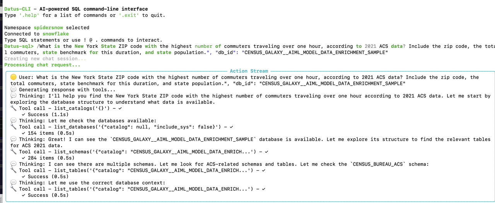
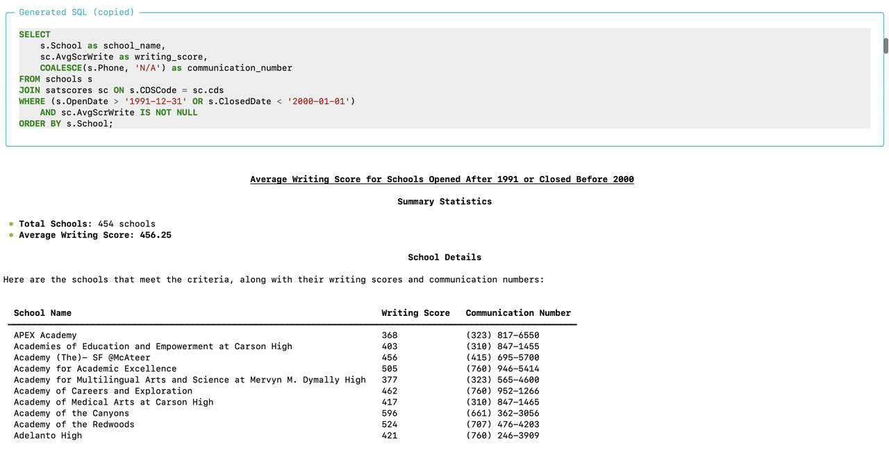
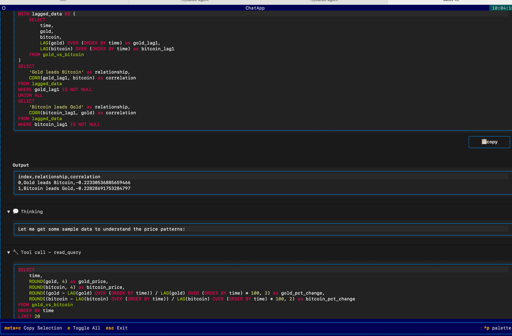
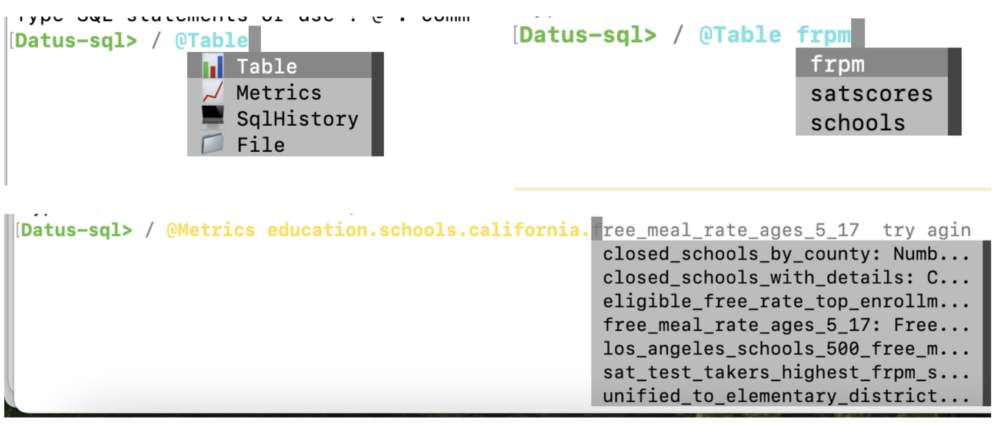
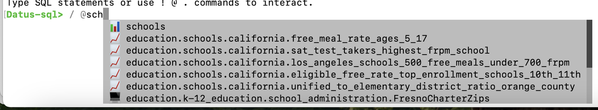

# 聊天命令 `/`

## 1. 概览

聊天命令 `/` 是 Datus-CLI 的核心。它让你可以在多轮会话中与 AI 智能体对话，用自然语言描述任务，并获得推理步骤与 SQL 建议。把它当成一起探索数据、起草 SQL、规划工作流的副驾驶——全部都在终端中完成。

你可以使用任何格式与 Datus 对话：纯文本、要点列表、逻辑草稿等；也可以自由修改或追问回复。智能体会记住你的指令和历史输出，让你无需重头开始就能逐步优化结果。

---

## 2. 基础用法

输入 `/` 加消息即可开启新会话：

```text
/ How many orders were placed last week?
```

智能体会返回推理过程与建议的 SQL。随后可以自然跟进：

```text
/ Filter only for VIP customers
```

Datus 会在思考时实时流式输出，展示每一步的执行结果。如果结果包含 SQL，将会：

- 自动在输出中高亮 SQL
- 将 SQL 复制到剪贴板，方便立即复用
- 最终输出一段 Markdown 格式的结果摘要







---

## 3. 高级能力

### 上下文注入

上下文注入可以把已有的数据表、指标或文件直接拉入对话。有两种方式：

#### 浏览模式
输入 `@` 后按 Tab，逐级浏览上下文树。按类别（数据表 / 文件 / 指标）导航，像目录一样深入，选择需要的条目。

#### 模糊搜索模式
输入 `@` 加关键词，再按 Tab 触发模糊搜索。Datus 会按文本相似度推荐上下文项，让你在不知道精确路径时也能快速定位。

这是为提示语注入精确上下文最快的方式。





### 会话命令

- `.clear`：清空当前会话上下文，从头开始
- `.compact`：压缩历史对话，减少上下文占用同时保留关键信息
  - 自动触发：当模型上下文使用率超过 90% 时，会自动执行 `.compact`，确保聊天不中断
- `.chat_info`：查看当前激活的上下文（消息、数据表、指标）

