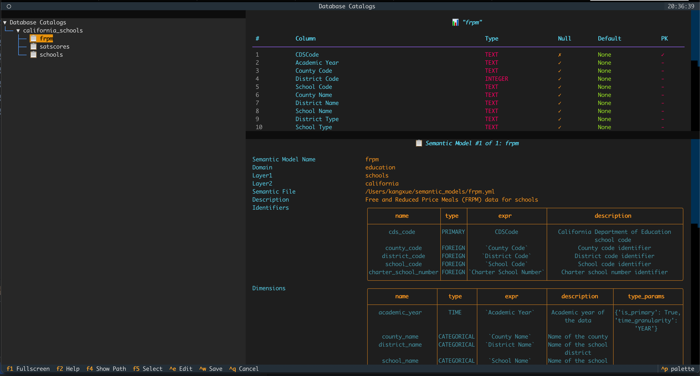
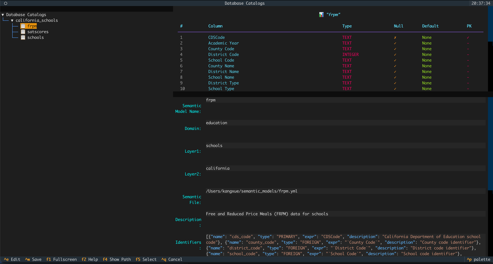
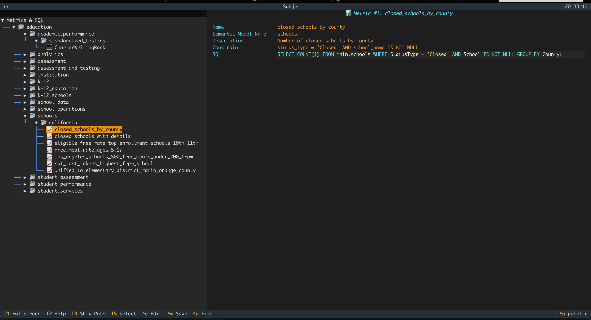
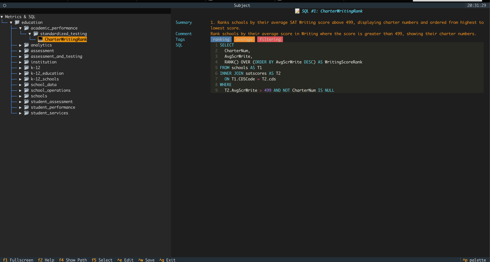
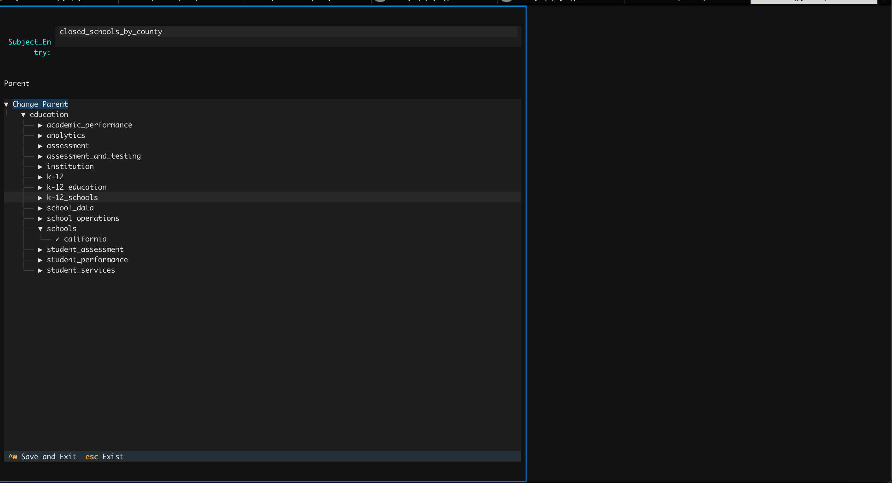
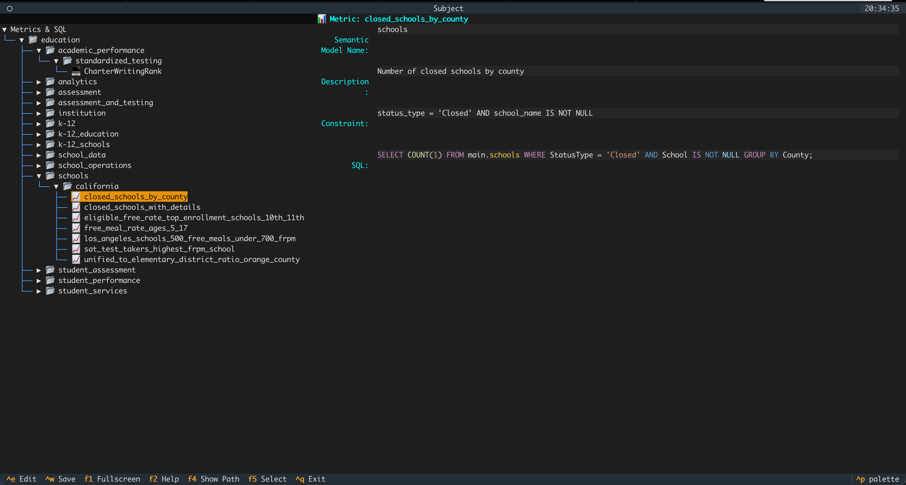
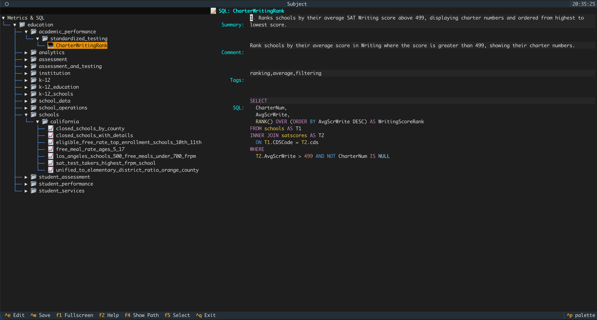

# Context Command `@`

## 1. Overview

The Context Command `@` allows you to inject rich contextual knowledge directly into your chat session. Instead of asking the model to guess your data structure, you can explicitly point it to the tables, metrics, or SQL snippets you want it to use — dramatically improving the accuracy of generated SQL.

Context items are organized into three separate trees:

- `@catalog` — your physical data structure (databases, schemas, tables)
- `@subject` — your semantic/business layer (domains, layers, semantic models, metrics)
- `@sql` — your historical knowledge (SQL history, reusable SQL snippets)

By combining these, you give Datus the same mental model you have — so it can reason with your data instead of guessing.

---

## 2. Basic Usage

You can summon the context browser by typing `@` and pressing Tab. Depending on which command you choose, you'll see a tree view you can drill down:

### @catalog
```
catalog
  └── database
      └── schema
          └── table
```



When your focus is on the panel where the **semantic model** is located and modify it via `Ctrl+e`.



### @subject
```
domain
  └── layer1
      └── layer2
          └── semantic_model
              └── metrics
              └── historical sqls
```





#### Modify Domain layers and Name
When your focus is on the **domain tree** on the left, you can modify it via `Ctrl+e`




#### Modify Metrics Details
When your focus is on the panel where the **metrics details** are located on the right, you can modify it via `Ctrl+e`.

#### Modify Historical SQL
When your focus is on the panel on the right where the **historical SQL details** is located, you can modify it via `Ctrl+e`


For the initialization of the context tree, you can refer to the Knowledge Base documentation.

## 3. Advanced Features

### Context Injection Modes

There are two ways to inject context in chat commands:

#### Browse Mode
Type `@` (or `@catalog`, `@subject`, `@sql`) and press Tab to open the tree browser, navigating node by node until you reach the desired table, metric, or SQL.

#### Fuzzy Search Mode
Type `@` (or `@any_text`) followed by any text, then press Tab. Datus will fuzzy search across all context trees and suggest the best matches, so you don't need to remember exact paths. Recent tables, metrics, and SQL searched in the [!execution command](execution_command.md) will appear at the top of the results.

### Examples

```bash
# Browse mode - navigate step by step
/ pay attention to @catalog <Tab>
# Select catalog > my_database > public > customers step by step

# Fuzzy search mode - quick keyword search
/ @revenue <Tab>
# Shows all revenue-related metrics across all domains
```

### Context Types

#### Physical Data (`@catalog`)
- Databases and schemas
- Table structures and column definitions
- Data types and constraints
- Foreign key relationships

#### Business Context (`@subject`)
- Business domains and data layers
- Semantic models and business logic
- Calculated metrics and KPIs
- Business glossary and definitions

#### Historical Knowledge (`@sql`)
- Previously executed SQL queries
- Reusable SQL snippets and templates
- Query patterns and best practices
- Optimization examples

Check the [knowledge base documentation](../knowledge_base/introduction.md) to learn how to build these context trees.  