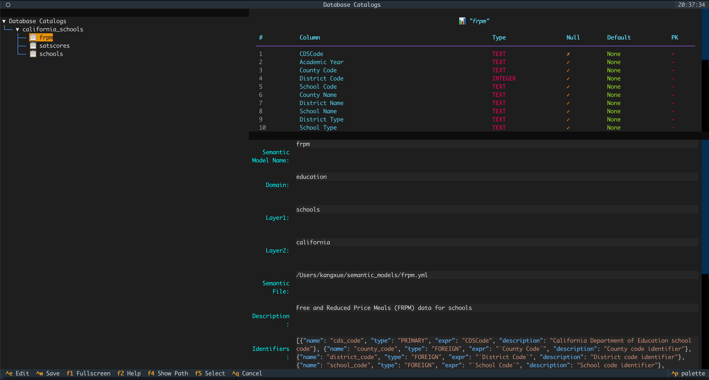
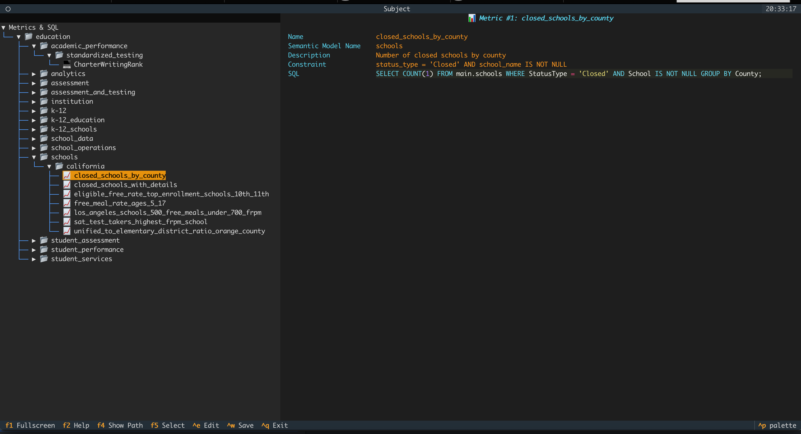
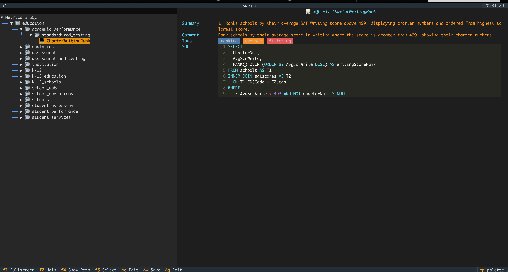
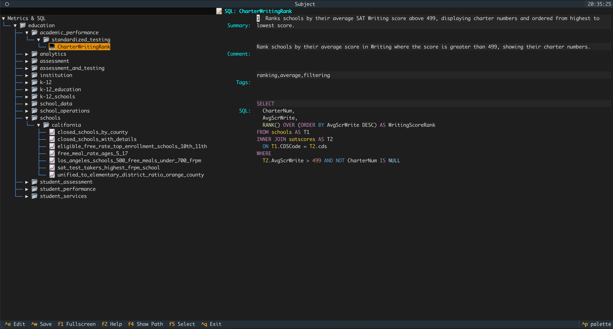

# 上下文命令 `@`

## 1. 概览

上下文命令 `@` 允许你将丰富的上下文知识直接注入对话会话。无需让模型猜测数据结构，你可以明确指出需要使用的数据表、指标或 SQL 片段，从而显著提高生成 SQL 的准确度。

上下文条目被组织成三棵独立的树：

- `@catalog` —— 物理数据结构（数据库、Schema、数据表）
- `@subject` —— 语义/业务层（域、层级、语义模型、指标）

通过组合这些结构，你向 Datus 提供与你一致的心智模型，让它以你的视角理解数据，而不是凭猜测推断。

---

## 2. 基础用法

输入 `@` 并按 Tab 可以唤起上下文浏览器。根据不同命令，会显示可逐级展开的树状视图：

### @catalog
```text
catalog
  └── database
      └── schema
          └── table
```


当焦点位于包含 **语义模型** 的面板时，可通过 `Ctrl+e` 进行编辑。



### @subject
```text
domain
  └── layer1
      └── layer2
          └── semantic_model
              └── metrics
              └── historical sqls
```





#### 编辑域层级与名称
当焦点位于左侧的 **树** 时，可通过 `Ctrl+e` 修改。


#### 编辑指标详情
当焦点位于右侧包含 **指标详情** 的面板时，可通过 `Ctrl+e` 修改。


#### 编辑历史 SQL
当焦点位于右侧显示 **历史 SQL 详情** 的面板时，可通过 `Ctrl+e` 修改。



关于上下文树的初始化，可参考知识库文档。

## 3. 高级能力

### 上下文注入模式

在聊天命令中有两种方式注入上下文：

#### 浏览模式
输入 `@`（或 `@catalog`、`@subject`、`@sql`）并按 Tab，逐级浏览树状结构，直到找到需要的数据表、指标或 SQL。

#### 模糊搜索模式
输入 `@`（或 `@任意文本`）后跟关键词，再按 Tab。Datus 会跨所有上下文树进行模糊搜索并推荐最佳匹配，无需记住精确路径。在 [!执行命令](execution_command.md) 中最近搜索过的表、指标与 SQL 会优先显示。

### 示例

```bash
# 浏览模式 —— 按步骤选择
/ pay attention to @catalog <Tab>
# 依次选择 catalog > my_database > public > customers

# 模糊搜索模式 —— 关键字快速查找
/ @revenue <Tab>
# 展示所有与 revenue 相关的指标
```

### 上下文类型

#### 物理数据（`@catalog`）
- 数据库与 Schema
- 表结构与字段定义
- 数据类型与约束
- 外键关系

#### 业务上下文（`@subject`）
- 业务域与层级划分
- 语义模型与业务逻辑
- 计算指标与 KPI
- 业务术语表与定义

#### 历史知识（`@sql`）
- 历史执行过的 SQL 查询
- 可复用的 SQL 片段与模板
- 查询模式与最佳实践
- 优化示例

更多关于如何构建这些上下文树的内容，请查阅 [知识库文档](../knowledge_base/introduction.md)。

