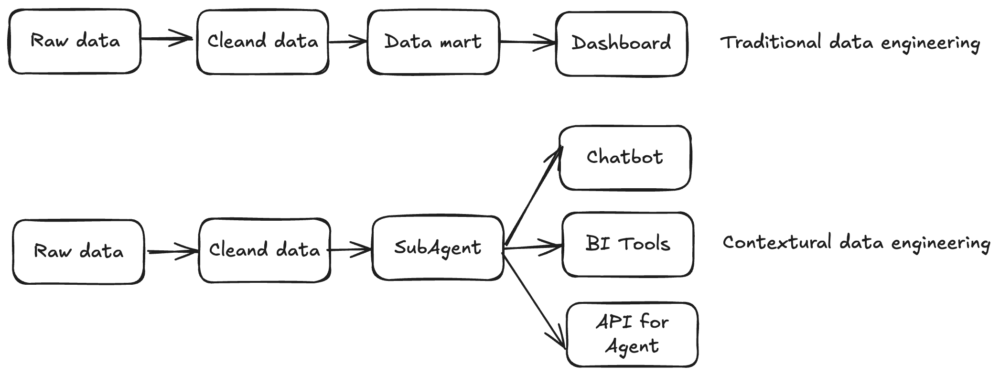
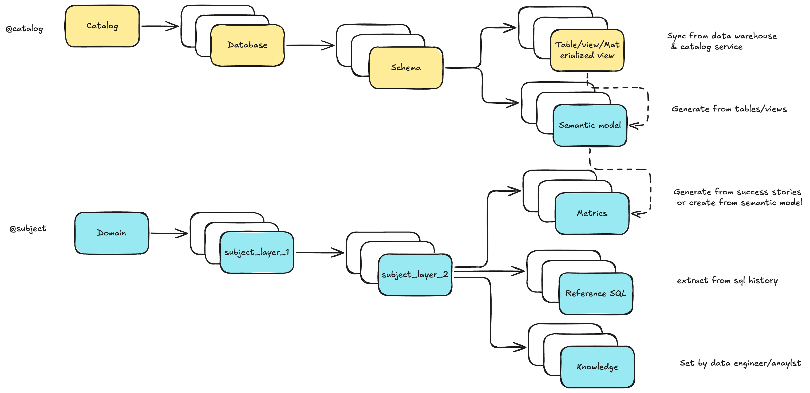
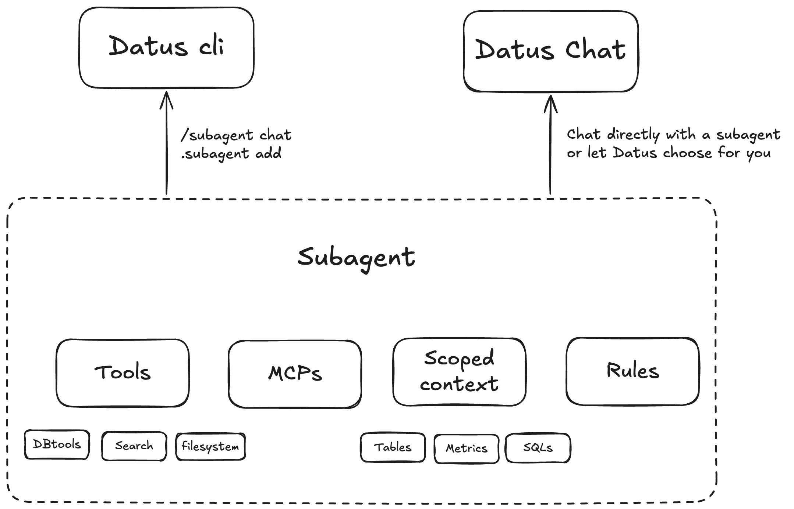

# Contextual Data Engineering

## What's Contextual Data Engineering

**Contextual Data Engineering** is a new paradigm that transforms how data systems are built, maintained, and used in the age of AI. Instead of delivering static tables and pipelines, it focuses on **building evolvable context** — a living, intelligent layer for data that integrates metadata, referenced SQLs, semantic models, and metrics into a unified system that both humans and AI agents can understand.



- **In traditional data engineering**, pipelines end with data delivery.
- **In contextual data engineering**, the pipeline itself becomes **a knowledge graph of your data system**, continuously learning from historical SQL, feedback loops, and human corrections.

It is not just about *moving data and build tables* — it's about *understanding and evolving* the context around the data.


## Why It Matters

**LLMs hallucinate without context**

Data context is a vast and complex space. We need data engineers — the ones who know the data best — to build reusable, AI-ready contexts that ground every query and response.

**Static tables don't scale for dynamic needs**

Modern business questions change daily. Ad-hoc data fetch requests consume half of a data engineer's time, but the knowledge behind those queries is rarely captured or reused.

**Traditional data engineering is not evolvable**

The focus has long been on the data consumer side (analytics and dashboards), not the producer side where context and accuracy are built. Contextual data engineering shifts that focus — empowering engineers to produce *living context* rather than static artifacts.

## Why Datus

**Automatic Context Capture**

Datus automatically captures, stores, and recalls historical SQL, table structures, metrics, and semantic layers on demand — turning every interaction into long-term knowledge.

**Enhanced Long-term Memory**

Dual recall mechanisms (Tree + Vector) allow the system to remember not just exact matches, but semantically related queries and patterns — forming a continuously growing "context graph" for your data.

**Evolving Context Engineering**

The system learns from both machine generation and human feedback, incrementally refining its context over time. Every correction, benchmark, or success story becomes part of a self-improving data memory.

## Core Concepts

### Long-Term Memory

We model **Data Engineering Context (Long-Term Memory)** as **two trees**:



- In [Datus CLI](../cli/introduction.md), you can browse and edit them via `@catalog` and `@subject`
- Use `datus-agent bootstrap-kb` to batch-initialize and cold-start the knowledge base
- With subagents, you can define a **scoped context** — a curated subset of the global store — enabling precise, domain-aware delivery

### Interactive Context Building

**Co-authored context**

LLMs draft semantic models and metrics from tables and SQL history, while engineers refine labels, metadata, and the subject tree.

**Command-driven iteration**

Commands like `/gen_semantic_model`, `/gen_metrics`, and `/gen_sql_summary` create and update assets. The `@catalog` and `@subject` screens support in-place edits.

**Feedback drives continuous improvement**

Exploration with `/chat`, success-story writebacks, and issue/benchmark loops convert usage into durable, reusable knowledge.

### Subagent System



**Scoped, domain-aware subagents**

Package description, rules, and scoped context — unifying tables, SQL patterns, metrics, and constraints for a specific business scenario.

**Configurable tools and MCPs**

Configure tools per scenario. Built-ins include DB tools, context-search tools, and filesystem tools. Enable and compose as needed.

**RL-ready architecture**

The subagent's scoped context forms an ideal RL environment (environment + question + SQL) for continuous training and evaluation.

### Tools and Components

**Datus CLI**

An interactive [CLI for data engineers](../cli/introduction.md) with context-aware compression and search tools. Provides three "magic commands":

- `/` to chat and orchestrate
- `@` to view and recall context
- `!` to execute node/tool actions

**Datus Agent**

A [benchmarking and bootstrap utility](../benchmark/benchmark_manual.md) — the batch companion to the CLI. Used to:

- Build initial context from historical data
- Run benchmarks and evaluations
- Expose corresponding APIs

**Datus Chat**

A lightweight web chatbot for analysts and business users, supporting:

- Multi-turn conversations
- Built-in feedback (upvotes, issue reports, success stories)


## User Journey

### Initial Exploration

**Kick off with `/chat`**

Probe the database and quickly validate end-to-end Q&A: schema understanding, simple aggregations, and table lookups.

**Refine with targeted hints**

Use `/question + @table @file` to provide examples, join rules, column notes, or query templates that ground the model in the right context.

**Tight feedback loop**

Try → inspect result → add clarifications (e.g., "use PK join between `orders` and `users`", "`status` ∈ {A,B,C}") → retry.

**Example:**

```bash
/chat What were last week's DAU and retention for the new region?
/question @table users events @file ./notes/retention_rules.md
```

### Building Context

**Import SQL history**

Capture proven patterns and edge-case handling. Promote high-value snippets into reusable blocks. See [SQL History Tracking](../knowledge_base/sql_history.md) for details.

**Generate first-pass assets**

- `/gen_semantic_model @table ...` — draft YAML for dimensions/measures
- `/gen_metrics @sql @semantic_model ...` — define business metrics and tests
- `/gen_sql_summary @file ./sql/` — summarize intent and dependencies

**Human-in-the-loop curation**

Refine domain → layer_1 → layer_2 descriptions, align naming conventions, and edit [metadata](../knowledge_base/metadata.md) directly in `@catalog` / `@subject`.

**Example:**

```bash
/gen_semantic_model @table fact_orders dim_users
/gen_metrics @sql ./sql/retention.sql @semantic_model ./models/game.yaml "30-day retention"
```

### Creating a Subagent

**Define a domain-aware chatbot**

Use `.subagent add <name>` for a specific scenario (e.g., "commercialization analytics").

**Package the essentials**

Include description, rules (join keys, filters, calculation rules), scoped context (tables, SQL snippets, metrics), and allowed tools.

**Constrain the search space**

Limit to selected catalogs/tables and enable only relevant tools/MCPs (DB tools, context search, filesystem where needed).

**Example:**

```bash
.subagent add california_schools
```

### Delivering and Iterating

**Ship to the web**

Serve the subagent as a lightweight chatbot UI for analysts to perform multi-turn analysis and report preview.

```bash
datus-agent --namespace schools --web
```

You can then access `http://localhost:8501/?subagent=california_schools` (change `localhost` to your IP address if you're deploying the subagent to your stakeholders).

**Collect and write back feedback**

Analysts upvote good results and report issues with traceable session links. Export successful runs as **success stories**.

**Close the loop**

When data engineers receive issue links from customers, they can revise SQL, update rules and metadata, build more metrics, or expand the scoped context. The subagent improves continuously as knowledge is captured.

## Next Steps

<div class="grid cards" markdown>

-   :material-database: **Knowledge Base**

    ---

    Explore detailed context management with metadata, metrics, and SQL history.

    [:octicons-arrow-right-24: Learn more](../knowledge_base/introduction.md)

-   :material-sitemap-outline: **Workflow Integration**

    ---

    Integrate context into automated data pipelines and orchestration.

    [:octicons-arrow-right-24: Explore workflows](../workflow/introduction.md)

-   :material-console-line: **CLI Context Commands**

    ---

    Master the CLI with hands-on context management commands.

    [:octicons-arrow-right-24: View commands](../cli/context_command.md)

-   :material-cog: **Configuration**

    ---

    Configure advanced settings for agents, namespaces, and storage.

    [:octicons-arrow-right-24: Configuration guide](../configuration/introduction.md)

</div>

## Related Resources

- [Metadata Management](../knowledge_base/metadata.md) - Organize and manage table schemas and column descriptions
- [Metrics Definition](../knowledge_base/metrics.md) - Define reusable business metrics
- [SQL History Tracking](../knowledge_base/sql_history.md) - Capture and leverage historical query patterns
- [Context Command Reference](../cli/context_command.md) - Complete CLI context command reference
