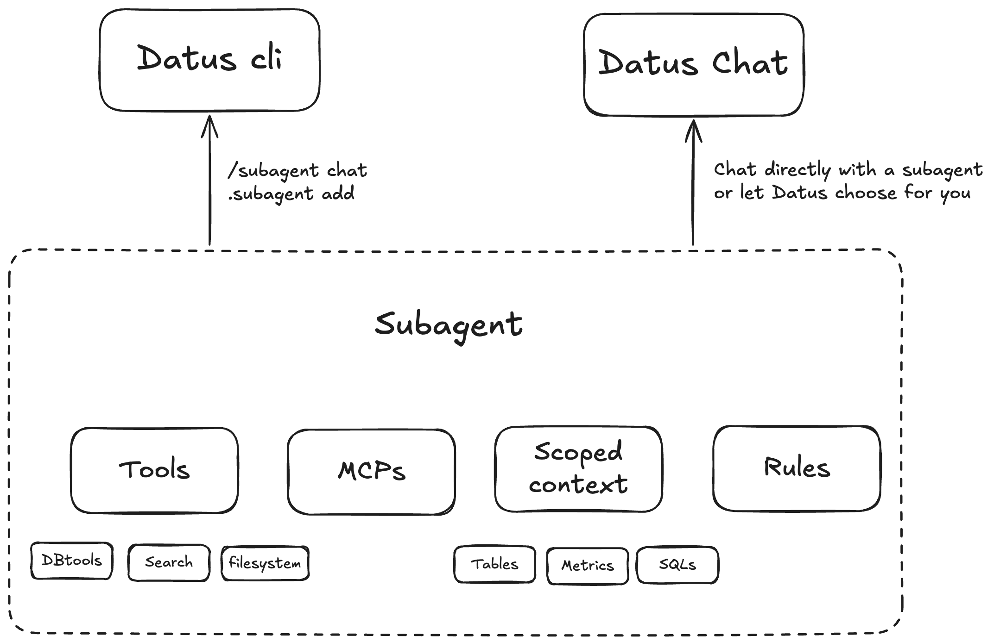

# 上下文数据工程

## 什么是上下文数据工程

**上下文数据工程（Contextual Data Engineering）** 是在 AI 时代重新定义数据系统构建、维护与使用方式的新范式。它不再仅仅交付静态的表和管道，而是专注于构建 **可演化的上下文**——一个智能、鲜活的数据层，将元数据、Reference SQL、语义模型与指标融为一体，既方便人工也方便 AI 智能体理解。


- **传统数据工程**：数据管道以交付数据为终点。
- **上下文数据工程**：管道本身演化为**数据系统的知识图谱**，持续吸收历史 SQL、反馈循环和人工修正。

这不只是“搬运数据、建表”，而是“理解并持续进化”围绕数据的上下文。

## 为什么重要

**缺乏上下文的大模型会产生幻觉**

数据上下文广阔且复杂。我们需要最懂数据的数据工程师来构建可复用、面向 AI 的上下文，为每一次查询和回答提供依据。

**静态数据表无法满足动态需求**

现代业务问题每天都在变化。临时分析请求占据了数据工程师一半的时间，而这些查询背后的知识很少被捕获或复用。

**传统数据工程缺乏可演化能力**

过去的关注点一直偏向数据消费者（分析与看板），而非构建上下文与准确性的生产端。上下文数据工程改变了这一点——让工程师输出“鲜活的上下文”，而非静态的工件。

## 为什么选择 Datus

**上下文自动捕获**

Datus 会按需捕获、存储并召回历史 SQL、数据表结构、指标与语义层，将每一次交互都转化为长期知识。

**强化的长期记忆**

双重召回机制（树结构 + 向量）不仅能记住精确匹配，还能识别语义相关的查询与模式，持续构建你的“上下文图谱”。

**不断演进的上下文工程**

系统从机器生成与人工反馈中学习，随时间迭代优化。每次纠错、基准测试或成功案例都会沉淀到自我进化的数据记忆中。

## 核心概念

### 长期记忆

我们将 **数据工程上下文（长期记忆）** 建模为 **两棵树** ：


- 在 [Datus CLI](../cli/introduction.md) 中，可以通过 `@catalog` 与 `@subject` 浏览和编辑
- 使用 `datus-agent bootstrap-kb` 批量初始化并冷启动知识库
- 借助子代理（Subagent），你可以定义**范围化上下文**——从全局存储中挑选一个精心整理的子集，实现精准、具领域感知的交付

### 交互式上下文构建

**协同创作的上下文**

大模型从数据表和Reference SQL 起草语义模型与指标，工程师负责完善标签、元数据和主题树。

**命令驱动的迭代**

使用 `/gen_semantic_model`、`/gen_metrics`、`/gen_sql_summary` 等命令创建或更新资产；`@catalog` 和 `@subject` 页面支持就地编辑。

**反馈驱动持续改进**

通过 `/chat` 探索、成功案例回写、问题与基准循环，将使用过程转化为可复用的长期知识。

### 子代理系统



**范围化、具领域感知的子代理**

将描述、规则和上下文打包，统一管理特定业务场景所需的数据表、SQL 模式、指标与约束。

**可配置的工具与 MCP**

针对不同场景配置工具。内置工具包括数据库、上下文搜索与文件系统等，可按需启用与组合。

**面向强化学习的架构**

子代理的范围化上下文构成理想的强化学习环境（环境 + 问题 + SQL），便于持续训练与评估。

### 工具与组件

**Datus CLI**

专为数据工程师打造的[交互式 CLI](../cli/introduction.md)，内置上下文压缩与检索。提供三类“魔法命令”：

- `/`：发起对话与编排
- `@`：查看与召回上下文
- `!`：执行节点/工具操作

**Datus Agent**

一个[基准测试与引导工具](../benchmark/benchmark_manual.md)，作为 CLI 的批处理伙伴，可用于：

- 从历史数据构建初始上下文
- 运行基准测试与评估
- 暴露相应 API

**Datus Chat**

面向分析师与业务用户的轻量级网页聊天机器人，支持：

- 多轮对话
- 内置反馈（点赞、问题反馈、成功案例）

## 用户旅程

### 初始探索

**从 `/chat` 开始**

探测数据库，快速验证端到端问答：理解表结构、完成简单聚合与查询。

**结合定向提示进行优化**

使用 `/question + @table @file` 提供示例、联接规则、字段说明或查询模板，让模型更快锁定正确上下文。

**建立紧密反馈循环**

尝试 → 检查结果 → 补充说明（例如“使用 `orders` 与 `users` 的主键联接”，“`status` ∈ {A,B,C}”）→ 再次执行。

**示例：**

```bash
/chat What were last week's DAU and retention for the new region?
/question @table users events @file ./notes/retention_rules.md
```

### 构建上下文

**导入Reference SQL**

捕获成熟模式和边界场景，将高价值片段提升为可复用模块。详见[Reference SQL 追踪](../knowledge_base/reference_sql.md)。

**生成初版资产**

- `/gen_semantic_model @table ...` —— 草拟维度与度量的 YAML
- `/gen_metrics @sql @semantic_model ...` —— 定义业务指标与测试
- `/gen_sql_summary @file ./sql/` —— 总结意图与依赖

**人工在环的策划**

完善 domain → layer_1 → layer_2 描述；统一命名规范；在 `@catalog` / `@subject` 中直接编辑[元数据](../knowledge_base/metadata.md)。

**示例：**

```bash
/gen_semantic_model @table fact_orders dim_users
/gen_metrics @sql ./sql/retention.sql @semantic_model ./models/game.yaml "30-day retention"
```

### 创建子代理

**定义具领域感知的聊天机器人**

使用 `.subagent add <name>` 为特定场景（如“商业化分析”）创建子代理。

**打包核心要素**

包含描述、规则（联接键、过滤条件、计算规则）、范围化上下文（数据表、SQL 片段、指标）及可用工具。

**约束搜索空间**

限制可用的目录/数据表，仅启用相关工具或 MCP（数据库、上下文搜索、必要时的文件系统）。

**示例：**

```bash
.subagent add california_schools
```

### 交付与迭代

**上线到 Web**

将子代理发布为轻量级聊天界面，供分析师进行多轮分析与报表预览。

```bash
datus-agent --namespace schools --web
```

随后可访问 `http://localhost:8501/?subagent=california_schools`（若对外部署，请将 `localhost` 替换为外网可访问的地址）。

**采集并回写反馈**

分析师可以对结果点赞、报告问题，并提供可追溯的会话链接。优秀案例可导出为**成功故事**。

**闭环改进**

数据工程师收到反馈后，可调整 SQL、更新规则与元数据、补充指标或扩展上下文范围。随着知识被不断捕获，子代理也持续进化。

## 下一步

<div class="grid cards" markdown>

-   :material-database: **知识库**

    ---

    探索包含元数据、指标与Reference SQL 的上下文管理细节。

    [:octicons-arrow-right-24: 深入了解](../knowledge_base/introduction.md)

-   :material-sitemap-outline: **工作流集成**

    ---

    将上下文融入自动化数据管道与编排系统。

    [:octicons-arrow-right-24: 探索工作流](../workflow/introduction.md)

-   :material-console-line: **CLI 上下文命令**

    ---

    通过实践掌握 CLI 上下文管理命令。

    [:octicons-arrow-right-24: 查看命令](../cli/context_command.md)

-   :material-cog: **配置**

    ---

    为智能体、命名空间与存储配置高级设置。

    [:octicons-arrow-right-24: 配置指南](../configuration/introduction.md)

</div>

## 相关资源

- [元数据管理](../knowledge_base/metadata.md) —— 组织与管理数据表结构和字段说明
- [指标定义](../knowledge_base/metrics.md) —— 定义可复用的业务指标
- [Reference SQL 追踪](../knowledge_base/reference_sql.md) —— 捕获并利用历史查询模式
- [上下文命令参考](../cli/context_command.md) —— CLI 上下文命令全览


