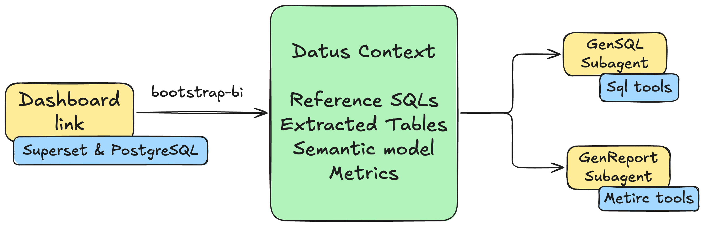

# Dashboard Copilot

Transform your BI dashboards into intelligent AI subagents with a single command. This guide walks you through deploying Superset with PostgreSQL, configuring Datus, and using the `bootstrap-bi` command to automatically generate context and subagents from your dashboard.

## Why Dashboard Copilot?

Traditional BI dashboards are static - they show predefined charts and metrics, but users cannot ask follow-up questions or explore data beyond what's been pre-built. **Datus Dashboard Copilot transforms these static dashboards into dynamic analysis copilots** that can:

- Answer ad-hoc questions using the same data and business logic as your dashboard
- Perform root cause analysis when metrics change unexpectedly
- Generate new SQL queries that stay consistent with your dashboard's semantic model
- Provide attribution analysis to explain what's driving metric changes

With one command, Datus extracts all the context from your existing dashboard - the SQL queries, table relationships, metrics definitions, and business logic - and creates AI subagents that understand your data as well as your dashboard does.

The bootstrap process automatically generates two specialized subagents: a **GenSQL subagent** that enables self-service data retrieval through SQL tools, and a **GenReport subagent** that provides analysis, drill-down, and attribution reports through metric tools.



## Prerequisites

Before you begin, ensure you have:

- Docker Desktop installed and running
- Kubernetes CLI (`kubectl`)
- Helm package manager
- Python 3.12 with Datus installed

## Step 1: Deploy Superset + PostgreSQL

First, install the required infrastructure tools.

### Install Dependencies

=== "macOS"

    ```bash
    brew install --cask docker
    brew install helm kubectl minikube
    ```

=== "Linux"

    ```bash
    # Install Docker
    curl -fsSL https://get.docker.com | sh

    # Install kubectl
    curl -LO "https://dl.k8s.io/release/$(curl -L -s https://dl.k8s.io/release/stable.txt)/bin/linux/amd64/kubectl"
    chmod +x kubectl && sudo mv kubectl /usr/local/bin/

    # Install Helm
    curl https://raw.githubusercontent.com/helm/helm/main/scripts/get-helm-3 | bash

    # Install minikube
    curl -LO https://storage.googleapis.com/minikube/releases/latest/minikube-linux-amd64
    sudo install minikube-linux-amd64 /usr/local/bin/minikube
    ```

=== "Windows"

    ```powershell
    # Install with Chocolatey
    choco install docker-desktop
    choco install kubernetes-helm
    choco install kubernetes-cli
    choco install minikube
    ```

### Start Minikube

```bash
minikube start --driver=docker
```

### Deploy Superset

Add the Superset Helm repository and deploy:

```bash
# Add Superset Helm repo
helm repo add superset https://apache.github.io/superset
helm repo update

# Deploy Superset with example configuration
helm upgrade --install superset superset/superset -n default -f ./examples-values.yaml
```

!!! tip "Custom Values"
    You can customize the deployment by modifying `examples-values.yaml`. See the [Superset Helm Chart documentation](https://github.com/apache/superset/tree/master/helm/superset) for available options.

### Wait for Pods

Monitor the deployment until all pods are running:

```bash
kubectl get pods -n default -w
```

Wait until you see all pods in `Running` state before proceeding.

### Set Up Port Forwarding

Expose Superset and PostgreSQL services locally:

```bash
# Forward Superset UI (port 8088)
kubectl port-forward -n default service/superset 8088:8088 &

# Forward PostgreSQL (port 15432)
kubectl port-forward -n default svc/superset-postgresql 15432:5432 &
```

You can now access Superset at [http://localhost:8088](http://localhost:8088) with default credentials `admin/admin`.

## Step 2: Configure Datus

Configure Datus to connect to both the PostgreSQL database and Superset dashboard.

### Install Required Extensions

```bash
pip install datus-postgresql datus-semantic-metricflow
```

### Update agent.yml

Add the following configuration to your `~/.datus/agent.yml`:

```yaml
agent:
  namespace:
    superset:
      type: postgresql
      host: 127.0.0.1
      port: 15432
      username: superset
      password: superset
      database: examples
  dashboard:
    superset:
      username: admin
      password: admin
      extra:
        provider: db
```

!!! note "Configuration Sections"
    - **namespace**: Defines the database connection for SQL execution
    - **dashboard**: Defines the BI platform credentials for dashboard access

## Step 3: Bootstrap from Dashboard

Now use the `bootstrap-bi` command to automatically generate context and subagents from your Superset dashboard. We'll use the World Bank's Data dashboard as an example.

### Run Bootstrap Command

```bash
datus-agent bootstrap-bi --namespace demo
```

### Interactive Flow

The command will guide you through an interactive process:

```{ .yaml .no-copy }
Select BI platform (superset): superset
Dashboard URL: http://localhost:8088/superset/dashboard/world_health/?native_filters_key=4X5gjZkIbnU
API base URL (e.g. https://host) (http://localhost:8088): http://localhost:8088
```

The system will display the dashboard information and extracted charts:


Select the charts and tables you want to include. The bootstrap process will then automatically:

**1. Build Metadata and Reference SQL**

The system analyzes each chart's SQL query and generates comprehensive documentation:


**2. Generate Semantic Model**

Datus creates a semantic model with measures, dimensions, and relationships:


**3. Extract Metrics**

The system identifies and validates metrics from the dashboard queries:


### Output

After the bootstrap completes, you'll have ready-to-use subagents:

```{ .yaml .no-copy }
Subagent `superset_world_bank_s` saved.
Subagent `superset_world_bank_s` bootstrapped.
Attribution Sub-Agent `superset_world_bank_s_attribution` saved.
```

## Step 4: Use Attribution Analysis

The bootstrapped attribution subagent enables powerful metric analysis capabilities.

### Example Query

```bash
Datus> /superset_world_bank_s_attribution compare 2014 and 2004, find the reason of population growth
```

The agent performs multi-step analysis using the metrics and dimensions from your dashboard:


### Attribution Analysis Capabilities

The attribution subagent provides:

- **Automatic Dimension Importance Ranking** - Identifies which dimensions most influence metric changes
- **Delta Contribution Calculation** - Quantifies each factor's contribution to the overall change
- **Root Cause Identification** - Pinpoints specific values driving metric movement

### Sample Output

The analysis generates a comprehensive report with key findings:


The report includes:

- **Overall Growth Metrics** - Comparison of total population, growth rate, and rural population percentage
- **Top Regional Contributors** - Which regions drove the most population increase
- **Top Country Contributors** - Individual country contributions to the change
- **Conclusion** - Summary of key insights explaining the metric movement

## Generated Subagents Explained

The `bootstrap-bi` command creates two types of subagents:

### GenSQL Subagent

The primary subagent (e.g., `superset_world_bank_s`) provides:

- SQL generation within the dashboard's semantic scope
- Context-aware queries using extracted metadata
- Reference SQL patterns from dashboard charts

**Example usage:**
```bash
/superset_world_bank_s show top 10 countries by life expectancy in 2020
```

### GenReport Subagent (Attribution)

The attribution subagent (e.g., `superset_world_bank_s_attribution`) provides:

- Metric comparison and trend analysis
- Root cause analysis for metric changes
- Dimension-level attribution reports

**Example usage:**
```bash
/superset_world_bank_s_attribution why did healthcare spending increase between 2010 and 2020?
```

## Next Steps

Now that you have your dashboard-powered subagents, explore more:

- **[Subagent Introduction](../subagent/introduction.md)** - Learn more about subagent capabilities
- **[Knowledge Base](../knowledge_base/introduction.md)** - Manage and extend your context
- **[Metrics](../knowledge_base/metrics.md)** - Define and manage your metrics
- **[Semantic Models](../knowledge_base/semantic_model.md)** - Customize your semantic layer
