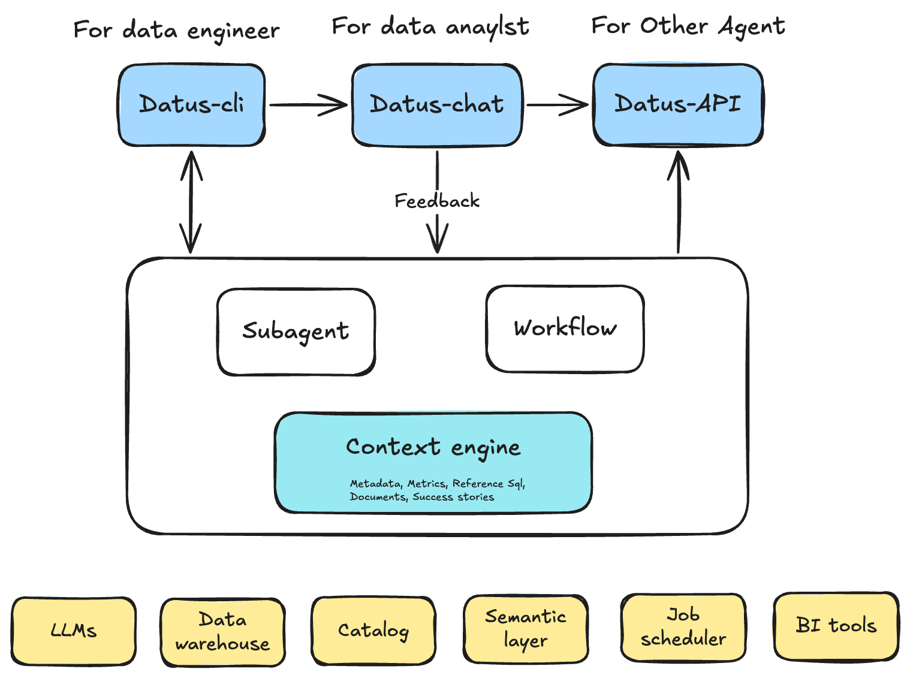

# Introduction

**Datus Agent** is the first contextual data engineering platform that builds **evolvable context** for your data systems. Unlike traditional tools that only move data, Datus captures, learns, and evolves the knowledge around your data—transforming metadata, SQL history, semantic models, and metrics into a living knowledge graph that grounds AI queries and eliminates hallucinations.

With Datus, data engineers shift from writing repetitive SQL to building reusable, AI-ready context. Every query, correction, and domain rule becomes long-term memory—enabling specialized subagents that deliver accurate, domain-aware analytics to your entire organization.

## Getting Started

Get your Datus Agent up and running in minutes.

!!! tip "Start Here"
    [:material-rocket-launch: **Quickstart Guide**](getting_started/Quickstart.md){ .md-button .md-button--primary }

    Get up and running with Datus Agent in just a few minutes

!!! info "Learn Key Concepts"
    [:material-book-open-variant: **Contextual Data Engineering**](getting_started/contextual_data_engineering.md){ .md-button }

    Discover how Datus leverages context from your data assets to enhance AI-powered workflows

## Important Topics

-   :material-console-line: **Datus CLI**

    ---

    Command-line interface for local development and real-time preview of your data workflows.
    
    [:octicons-arrow-right-24: Learn more](cli/introduction.md)

-   :material-database: **Knowledge Base**

    ---

    Centralized repository for organizing and managing your data assets and documentation.
    
    [:octicons-arrow-right-24: Browse knowledge base](knowledge_base/introduction.md)

-   :material-robot-outline: **Subagent System**

    ---

    Extend Datus with specialized subagents for different data engineering tasks and workflows.

    [:octicons-arrow-right-24: Explore subagents](subagent/introduction.md)

-   :material-sitemap-outline: **Workflow Management**

    ---

    Design and orchestrate complex data pipelines with configurable workflow builder.
    
    [:octicons-arrow-right-24: Explore workflows](workflow/introduction.md)

