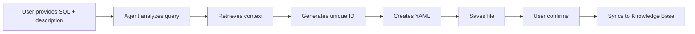
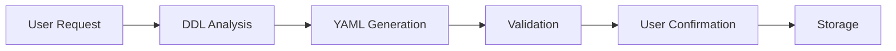
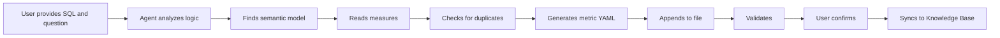

# Builtin Subagents

## Overview

The **Builtin Subagents** are specialized AI assistants integrated within the Datus Agent system. Each subagent focuses on a specific aspect of data engineering automation — analyzing SQL, generating semantic models, and converting queries into reusable metrics — together forming a closed-loop workflow from raw SQL to knowledge-aware data products.

This document covers three core subagents:

1. **[gen_sql_summary](#gen_sql_summary)** — Summarizes and classifies SQL queries
2. **[gen_semantic_model](#gen_semantic_model)** — Generates MetricFlow semantic models
3. **[gen_metrics](#gen_metrics)** — Generates MetricFlow metric definitions

---

## gen_sql_summary

### Overview

The SQL Summary feature helps you analyze, classify, and catalog SQL queries for knowledge reuse. It automatically generates structured YAML summaries that are stored in a searchable Knowledge Base, making it easy to find and reuse similar queries in the future.

### What is a SQL Summary?

A **SQL summary** is a structured YAML document that captures:

- **Query Text**: The complete SQL query
- **Business Context**: Domain, categories, and tags
- **Semantic Summary**: Detailed explanation for vector search
- **Metadata**: Name, comment, file path

### Quick Start

Launch the SQL summary generation subagent:

```bash
/gen_sql_summary Analyze this SQL: SELECT SUM(revenue) FROM sales GROUP BY region. (You can also add some description on this SQL)
```

### Generation Workflow



**Detailed Steps:**

1. **Understand SQL**: The AI analyzes your query structure and business logic
2. **Get Context**: Calls `prepare_sql_summary_context()` to retrieve:
   - Existing taxonomy (domains, categories, tags)
   - Similar SQL summaries for classification reference
3. **Generate Unique ID**: Uses `generate_sql_summary_id()` based on SQL + comment
4. **Create Unique Name**: Generates a descriptive name (max 20 characters)
5. **Classify Query**: Assigns domain, layer1, layer2, and tags following existing patterns
6. **Generate YAML**: Creates structured summary document
7. **Save File**: Writes YAML to workspace using `write_file()`
8. **User Confirmation**: Shows the generated YAML and prompts for approval
9. **Sync to Knowledge Base**: Stores in LanceDB for semantic search

### Interactive Confirmation

After generation, you'll see:

```
==========================================================
Generated SQL History YAML
File: /path/to/sql_summary.yml
==========================================================
[YAML content with syntax highlighting]

  SYNC TO KNOWLEDGE BASE?

  1. Yes - Save to Knowledge Base
  2. No - Keep file only

Please enter your choice: [1/2]
```

### Configuration

#### Agent Configuration

In `agent.yml`:

```yaml
agentic_nodes:
  gen_sql_summary:
    model: deepseek                        # LLM model for analysis
    system_prompt: gen_sql_summary         # Prompt template
    prompt_version: "1.0"
    tools: generation_tools.prepare_sql_summary_context, generation_tools.generate_sql_summary_id, filesystem_tools.write_file
    hooks: generation_hooks                # Enable confirmation workflow
    workspace_root: /path/to/sql_history   # Directory to save YAML files
    agent_description: "SQL history analysis assistant"
```

#### Key Configuration Options

| Parameter | Description | Example |
|-----------|-------------|---------|
| `model` | LLM model for SQL analysis | `deepseek`, `claude`, `openai`, `kimi` |
| `workspace_root` | Directory for SQL summary YAML files | `/Users/you/.datus/data/sql_history` |
| `tools` | Required tools for the workflow | See tools section below |
| `hooks` | Enable interactive confirmation | `generation_hooks` |

### YAML Structure

The generated SQL summary follows this structure:

```yaml
id: "abc123def456..."                      # Auto-generated MD5 hash
name: "Revenue by Region"                  # Descriptive name (max 20 chars)
sql: |                                     # Complete SQL query
  SELECT
    region,
    SUM(revenue) as total_revenue
  FROM sales
  GROUP BY region
comment: "Calculate total revenue grouped by region"
summary: "This query aggregates total revenue from the sales table, grouping results by geographic region. It uses SUM aggregation to calculate revenue totals for each region."
filepath: "/Users/you/.datus/data/sql_history/revenue_by_region.yml"
domain: "Sales"                            # Business domain
layer1: "Reporting"                        # Primary category
layer2: "Revenue Analysis"                 # Secondary category
tags: "revenue, region, aggregation"       # Comma-separated tags
```

#### Field Descriptions

| Field | Required | Description | Example |
|-------|----------|-------------|---------|
| `id` | Yes | Unique hash (auto-generated) | `abc123def456...` |
| `name` | Yes | Short descriptive name (max 20 chars) | `Revenue by Region` |
| `sql` | Yes | Complete SQL query | `SELECT ...` |
| `comment` | Yes | Brief one-line description | User's message or generated summary |
| `summary` | Yes | Detailed explanation (for search) | Comprehensive query description |
| `filepath` | Yes | Actual file path | `/path/to/file.yml` |
| `domain` | Yes | Business domain | `Sales`, `Marketing`, `Finance` |
| `layer1` | Yes | Primary category | `Reporting`, `Analytics`, `ETL` |
| `layer2` | Yes | Secondary category | `Revenue Analysis`, `Customer Insights` |
| `tags` | Optional | Comma-separated keywords | `revenue, region, aggregation` |

---

## gen_semantic_model

### Overview

The semantic model generation feature helps you create MetricFlow semantic models from database tables through an AI-powered assistant. The assistant analyzes your table structure and generates comprehensive YAML configuration files that define metrics, dimensions, and relationships.

### What is a Semantic Model?

A semantic model is a YAML configuration that defines:

- **Measures**: Metrics and aggregations (SUM, COUNT, AVERAGE, etc.)
- **Dimensions**: Categorical and time-based attributes
- **Identifiers**: Primary and foreign keys for relationships
- **Data Source**: Connection to your database table

### Quick Start

Start Datus CLI with `datus --namespace <namespace>`, and begin with a subagent command:

```bash
/gen_semantic_model generate a semantic model for table <table_name>
```

### How It Works

#### Interactive Generation

When you request a semantic model, the AI assistant:

1. Retrieves your table's DDL (structure)
2. Checks if a semantic model already exists
3. Generates a comprehensive YAML file
4. Validates the configuration using MetricFlow
5. Prompts you to save it to the Knowledge Base

#### Generation Workflow



### Interactive Confirmation

After generating the semantic model, you'll see:

```
=============================================================
Generated YAML: table_name.yml
Path: /path/to/file.yml
=============================================================
[YAML content with syntax highlighting]

SYNC TO KNOWLEDGE BASE?

1. Yes - Save to Knowledge Base
2. No - Keep file only

Please enter your choice: [1/2]
```

**Options:**

- **Option 1**: Saves the semantic model to your Knowledge Base (RAG storage) for AI-powered queries
- **Option 2**: Keeps the YAML file only without syncing to the Knowledge Base

### Configuration

#### Agent Configuration

In `agent.yml`, configure the semantic model generation node:

```yaml
agentic_nodes:
  gen_semantic_model:
    model: claude                    # LLM model to use
    system_prompt: gen_semantic_model
    prompt_version: "1.0"
    tools: db_tools.*, generation_tools.*, filesystem_tools.*
    hooks: generation_hooks          # Enables user confirmation workflow
    mcp: metricflow_mcp             # MetricFlow validation server
    workspace_root: /path/to/semantic_models
    agent_description: "Semantic model generation assistant"
    rules:
      - Use get_table_ddl tool to get complete table DDL
      - Generate comprehensive semantic models
      - Validate using metricflow_mcp
```

#### Key Configuration Options

| Parameter | Description | Example |
|-----------|-------------|---------|
| `model` | LLM model for generation | `claude`, `deepseek` (claude is recommended) |
| `workspace_root` | Directory to save YAML files | `/Users/you/.datus/data/semantic_models` |
| `tools` | Available tools for the assistant | `db_tools.*`, `filesystem_tools.*` |
| `hooks` | Enable user confirmation | `generation_hooks` |
| `mcp` | MetricFlow validation server | `metricflow_mcp` |

### Semantic Model Structure

#### Basic Template

```yaml
data_source:
  name: table_name                    # Required: lowercase with underscores
  description: "Table description"

  sql_table: schema.table_name        # For databases with schemas
  # OR
  sql_query: |                        # For custom queries
    SELECT * FROM table_name

  measures:
    - name: total_amount              # Required
      agg: SUM                        # Required: SUM|COUNT|AVERAGE|etc.
      expr: amount_column             # Column or SQL expression
      create_metric: true             # Auto-create queryable metric
      description: "Total transaction amount"

  dimensions:
    - name: created_date
      type: TIME                      # Required: TIME|CATEGORICAL
      type_params:
        is_primary: true              # One primary time dimension required
        time_granularity: DAY         # Required for TIME: DAY|WEEK|MONTH|etc.

    - name: status
      type: CATEGORICAL
      description: "Order status"

  identifiers:
    - name: order_id
      type: PRIMARY                   # PRIMARY|FOREIGN|UNIQUE|NATURAL
      expr: order_id

    - name: customer
      type: FOREIGN
      expr: customer_id
```

### Summary

The semantic model generation feature provides:

- ✅ Automated YAML generation from table DDL
- ✅ Interactive validation and error fixing
- ✅ User confirmation before storage
- ✅ Knowledge Base integration
- ✅ Duplicate prevention
- ✅ MetricFlow compatibility

---

## gen_metrics

### Overview

The metrics generation feature helps you convert SQL queries into reusable MetricFlow metric definitions. Using an AI assistant, you can analyze SQL business logic and automatically generate standardized YAML metric configurations that can be queried consistently across your organization.

### What is a Metric?

A **metric** is a reusable business calculation built on top of semantic models. Metrics provide:

- **Consistent Business Logic**: One definition, used everywhere
- **Type Safety**: Validated structure and measure references
- **Metadata**: Display names, formats, business context
- **Composability**: Build complex metrics from simpler ones

**Example**: Instead of writing `SELECT SUM(revenue) / COUNT(DISTINCT customer_id)` repeatedly, define an `avg_customer_revenue` metric once.

### Quick Start

Start Datus CLI with `datus --namespace <namespace>`, and use the metrics generation subagent:

```bash
/gen_metrics Generate a metric from this SQL: SELECT SUM(amount) FROM transactions, the corresponding question is total amount of all transactions
```

### How It Works

#### Generation Workflow



#### Important Limitations

> **⚠️ Single Table Queries Only**
>
> The current version **only supports generating metrics from single-table SQL queries**. Multi-table JOINs are not supported.

**Supported:**
```sql
SELECT SUM(revenue) FROM transactions WHERE status = 'completed'
SELECT COUNT(DISTINCT customer_id) / COUNT(*) FROM orders
```

**Not Supported:**
```sql
SELECT SUM(o.amount)
FROM orders o
JOIN customers c ON o.customer_id = c.id  -- ❌ JOIN not supported
```

### Interactive Confirmation

After generation, you'll see:

```
==========================================================
Generated YAML: transactions.yml
Path: /Users/you/.datus/data/semantic_models/transactions.yml
==========================================================
[YAML content with syntax highlighting showing the new metric]

  SYNC TO KNOWLEDGE BASE?

  1. Yes - Save to Knowledge Base
  2. No - Keep file only

Please enter your choice: [1/2]
```

**Options:**
- **Option 1**: Syncs the metric to your Knowledge Base for AI-powered semantic search
- **Option 2**: Keeps the YAML file only without syncing to the Knowledge Base

### Configuration

#### Agent Configuration

In `agent.yml`, configure the metrics generation node:

```yaml
agentic_nodes:
  gen_metrics:
    model: claude                          # LLM model for metric generation
    system_prompt: gen_metrics             # Prompt template name
    prompt_version: "1.0"                  # Template version
    tools: generation_tools.*, filesystem_tools.*
    hooks: generation_hooks                # Enable user confirmation workflow
    mcp: metricflow_mcp                    # MetricFlow validation server
    max_turns: 40                          # Max conversation turns
    workspace_root: /path/to/semantic_models
    agent_description: "Metric definition generation assistant"
    rules:
      - Analyze user-provided SQL queries to generate MetricFlow metrics
      - Use list_allowed_directories to find existing semantic model files
      - Use read_file to read semantic model and understand measures
      - Use check_metric_exists tool to avoid duplicate generation
      - Use edit_file to append metrics (DO NOT use write_file)
      - Use mf validate-configs to validate configurations
      - After validation, call end_generation to trigger confirmation
```

#### Key Configuration Options

| Parameter | Description | Example |
|-----------|-------------|---------|
| `model` | LLM model for generation | `claude`, `openai`, `deepseek` (claude is recommended) |
| `workspace_root` | Directory containing semantic model YAML files | `/Users/you/.datus/data/semantic_models` |
| `tools` | Available tools (generation + filesystem) | `generation_tools.*, filesystem_tools.*` |
| `hooks` | Enable interactive confirmation workflow | `generation_hooks` |
| `mcp` | MetricFlow validation server | `metricflow_mcp` |
| `max_turns` | Max conversation turns for complex queries | `40` |

### Usage Examples

#### Example 1: Simple Aggregation

**User Input:**
```bash
/gen_metrics Generate a metric for total order count
```

**Agent Actions:**
1. Finds `orders.yml` semantic model
2. Reads file to discover `order_count` measure
3. Generates MEASURE_PROXY metric:

```yaml
---
metric:
  name: total_orders
  description: Total number of orders
  type: measure_proxy
  type_params:
    measure: order_count
  locked_metadata:
    display_name: "Total Orders"
    increase_is_good: true
```

#### Example 2: Conversion Rate

**User Input:**
```bash
/gen_metrics Create a metric from this SQL:
SELECT
  COUNT(DISTINCT CASE WHEN status = 'completed' THEN order_id END) /
  COUNT(DISTINCT order_id) AS completion_rate
FROM orders
```

**Agent Actions:**
1. Analyzes SQL logic (ratio with conditional counting)
2. Finds `orders.yml` and reads measures
3. Generates RATIO metric with constraint:

```yaml
---
metric:
  name: order_completion_rate
  description: Percentage of orders that reached completed status
  type: ratio
  type_params:
    numerator:
      name: order_count
      constraint: status = 'completed'
    denominator: order_count
  locked_metadata:
    display_name: "Order Completion Rate"
    value_format: ".2%"
    increase_is_good: true
```

#### Example 3: Complex Calculation

**User Input:**
```bash
/gen_metrics Generate average basket size metric:
SELECT SUM(total_amount) / COUNT(DISTINCT order_id)
FROM order_items
```

**Agent Actions:**
1. Locates `order_items.yml`
2. Identifies this as a RATIO (average)
3. Generates metric:

```yaml
---
metric:
  name: avg_basket_size
  description: Average order value (basket size)
  type: ratio
  type_params:
    numerator: total_amount
    denominator: order_count
  locked_metadata:
    display_name: "Average Basket Size"
    value_format: "$$,.2f"
    unit: "dollars"
    increase_is_good: true
```

### How Metrics Are Stored

#### File Organization

Metrics are appended to existing semantic model files using the YAML document separator `---`:

```yaml
# Existing semantic model
data_source:
  name: transactions
  sql_table: transactions
  measures:
    - name: revenue
      agg: SUM
      expr: amount
  dimensions:
    - name: transaction_date
      type: TIME

---
# First metric (appended)
metric:
  name: total_revenue
  type: measure_proxy
  type_params:
    measure: revenue

---
# Second metric (appended)
metric:
  name: avg_transaction_value
  type: ratio
  type_params:
    numerator: revenue
    denominator: transaction_count
```

**Why append instead of separate files?**
- Keeps related metrics close to their semantic model
- Easier maintenance and validation
- MetricFlow can validate all definitions together

#### Knowledge Base Storage

When you choose "1. Yes - Save to Knowledge Base", the metric is stored in a Vector Database with:

1. **Metadata**: Name, description, type, domain/layer classification
2. **LLM Text**: Natural language representation for semantic search
3. **References**: Associated semantic model name
4. **Timestamp**: Creation date

### Summary

The metrics generation feature provides:

- ✅ **SQL-to-Metric Conversion**: Analyze SQL queries and generate MetricFlow metrics
- ✅ **Intelligent Type Detection**: Automatically selects the right metric type
- ✅ **Duplicate Prevention**: Checks for existing metrics before generation
- ✅ **Validation**: MetricFlow validation ensures correctness
- ✅ **Interactive Workflow**: Review and approve before syncing
- ✅ **Knowledge Base Integration**: Semantic search for metric discovery
- ✅ **File Management**: Appends to existing semantic model files safely

---

## Summary

| Subagent | Purpose | Output | Stored In | Highlights |
|----------|---------|--------|-----------|------------|
| `gen_sql_summary` | Summarize and classify SQL queries | YAML (SQL summary) | `/data/sql_history` | Taxonomy-based classification |
| `gen_semantic_model` | Generate semantic model from tables | YAML (semantic model) | `/data/semantic_models` | DDL → MetricFlow compatible model |
| `gen_metrics` | Generate metrics from SQL | YAML (metric) | `/data/semantic_models` | SQL → MetricFlow metric |

Together, these subagents automate the **data engineering knowledge pipeline** — from **query understanding → model definition → metric generation → searchable Knowledge Base**.