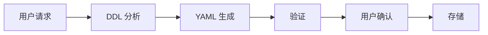
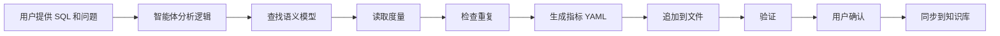

# 内置 Subagent

## 概览

**内置 Subagent**  是集成在 Datus Agent 系统中的专用 AI 助手。每个subagent专注于数据工程自动化的特定方面——分析 SQL、生成语义模型、将查询转换为可复用指标——共同构成从原始 SQL 到具备知识感知的数据产品的闭环工作流。

本文档涵盖三个核心subagent：

1. **[gen_sql_summary](#gen_sql_summary)** — 总结和分类 SQL 查询
2. **[gen_semantic_model](#gen_semantic_model)** — 生成 MetricFlow 语义模型
3. **[gen_metrics](#gen_metrics)** — 生成 MetricFlow 指标定义

## 配置

内置subagent开箱即用，最小化配置。大部分设置（工具、hooks、MCP 服务器、系统提示）都是内置的。你可以在 `agent.yml` 文件中自定义：

```yaml
agent:
  agentic_nodes:
    gen_semantic_model:
      model: claude     # 可选：默认使用已配置的模型
      max_turns: 30     # 可选：默认为 30

    gen_metrics:
      model: claude     # 可选：默认使用已配置的模型
      max_turns: 30     # 可选：默认为 30

    gen_sql_summary:
      model: deepseek   # 可选：默认使用已配置的模型
      max_turns: 30     # 可选：默认为 30
```

**可选配置参数**：

- `model`：使用的 AI 模型（如 `claude`、`deepseek`）。默认使用已配置的模型。
- `max_turns`：最大对话轮数（默认：30）

**内置配置**（无需设置）：
- **工具**：根据 subagent 类型自动配置
- **Hooks**：交互模式下的用户确认工作流
- **MCP 服务器**：MetricFlow 验证（用于 gen_semantic_model 和 gen_metrics）
- **系统提示**：内置模板版本 1.0
- **工作空间**：`~/.datus/data/{namespace}/` 及 subagent 特定子目录

---

## gen_sql_summary

### 概览

SQL 摘要功能帮助你分析、分类和编目 SQL 查询，用于知识复用。它自动生成结构化的 YAML 摘要，存储在可搜索的知识库中，便于将来查找和复用相似的查询。

### 什么是 SQL 摘要？

**SQL 摘要** 是一个结构化 YAML 文档，包含：

- **查询文本**：完整的 SQL 查询
- **业务上下文**：域、类别和标签
- **语义摘要**：用于向量搜索的详细说明
- **元数据**：名称、注释、文件路径

### 快速开始

启动 SQL 摘要生成 subagent：

```bash
/gen_sql_summary Analyze this SQL: SELECT SUM(revenue) FROM sales GROUP BY region. (You can also add some description on this SQL)
```

### 生成工作流


**详细步骤**：

1. **理解 SQL**：AI 分析你的查询结构和业务逻辑
2. **获取上下文**：自动从知识库检索：
   - 现有主题树（domain/layer1/layer2 组合）
   - 类似的 SQL 摘要（最相似的前 5 个查询）用于分类参考
3. **生成唯一 ID**：使用 `generate_sql_summary_id()` 工具，基于 SQL + 注释生成
4. **创建唯一名称**：生成描述性名称（最多 20 个字符）
5. **分类查询**：按照现有模式分配域、layer1、layer2 和标签
6. **生成 YAML**：创建结构化摘要文档
7. **保存文件**：使用 `write_file()` 工具将 YAML 写入工作空间
8. **用户确认**：显示生成的 YAML 并提示批准
9. **同步到知识库**：存储到 LanceDB 用于语义搜索

### 交互式确认

生成后，你会看到：

```
==========================================================
Generated Reference SQL YAML
File: /path/to/sql_summary.yml
==========================================================
[带语法高亮的 YAML 内容]

  SYNC TO KNOWLEDGE BASE?

  1. Yes - Save to Knowledge Base
  2. No - Keep file only

Please enter your choice: [1/2]
```

### 主题树分类

在 CLI 模式下通过问题中包含主题树来组织 SQL 摘要：

**带主题树示例：**
```bash
/gen_sql_summary Analyze this SQL: SELECT SUM(revenue) FROM sales, subject_tree: sales/reporting/revenue_analysis
```

**不带主题树示例：**
```bash
/gen_sql_summary Analyze this SQL: SELECT SUM(revenue) FROM sales
```

未提供时，agent 会基于知识库中的现有主题树和相似查询自动建议分类。

### YAML 结构

生成的 SQL 摘要遵循以下结构：

```yaml
id: "abc123def456..."                      # 自动生成的 MD5 哈希
name: "Revenue by Region"                  # 描述性名称（最多 20 个字符）
sql: |                                     # 完整 SQL 查询
  SELECT
    region,
    SUM(revenue) as total_revenue
  FROM sales
  GROUP BY region
comment: "Calculate total revenue grouped by region"
summary: "This query aggregates total revenue from the sales table, grouping results by geographic region. It uses SUM aggregation to calculate revenue totals for each region."
filepath: "/Users/you/.datus/data/reference_sql/revenue_by_region.yml"
domain: "Sales"                            # 业务域
layer1: "Reporting"                        # 主要类别
layer2: "Revenue Analysis"                 # 次要类别
tags: "revenue, region, aggregation"       # 逗号分隔的标签
```

#### 字段说明

| 字段 | 必需 | 描述 | 示例 |
|-------|----------|-------------|---------|
| `id` | 是 | 唯一哈希（自动生成） | `abc123def456...` |
| `name` | 是 | 简短描述性名称（最多 20 个字符） | `Revenue by Region` |
| `sql` | 是 | 完整 SQL 查询 | `SELECT ...` |
| `comment` | 是 | 简短的单行描述 | 用户消息或生成的摘要 |
| `summary` | 是 | 详细说明（用于搜索） | 全面的查询描述 |
| `filepath` | 是 | 实际文件路径 | `/path/to/file.yml` |
| `domain` | 是 | 业务域 | `Sales`、`Marketing`、`Finance` |
| `layer1` | 是 | 主要类别 | `Reporting`、`Analytics`、`ETL` |
| `layer2` | 是 | 次要类别 | `Revenue Analysis`、`Customer Insights` |
| `tags` | 可选 | 逗号分隔的关键字 | `revenue, region, aggregation` |

---

## gen_semantic_model

### 概览

语义模型生成功能帮助你通过 AI 助手从数据库表创建 MetricFlow 语义模型。助手分析你的表结构并生成全面的 YAML 配置文件，定义指标、维度和关系。

### 什么是语义模型？

语义模型是定义以下内容的 YAML 配置：

- **度量（Measures）**：指标和聚合（SUM、COUNT、AVERAGE 等）
- **维度（Dimensions）**：分类和时间属性
- **标识符（Identifiers）**：用于关系的主键和外键
- **数据源（Data Source）**：与数据库表的连接

### 快速开始

使用 `datus --namespace <namespace>` 启动 Datus CLI，然后使用subagent命令：

```bash
/gen_semantic_model generate a semantic model for table <table_name>
```

### 工作原理

#### 交互式生成

当你请求语义模型时，AI 助手会：

1. 检索你的表的 DDL（结构）
2. 检查是否已存在语义模型
3. 生成全面的 YAML 文件
4. 使用 MetricFlow 验证配置
5. 提示你保存到知识库

#### 生成工作流



### 交互式确认

生成语义模型后，你会看到：

```text
=============================================================
Generated YAML: table_name.yml
Path: /path/to/file.yml
=============================================================
[带语法高亮的 YAML 内容]

SYNC TO KNOWLEDGE BASE?

1. Yes - Save to Knowledge Base
2. No - Keep file only

Please enter your choice: [1/2]
```

**选项**：

- **选项 1**：将语义模型保存到你的知识库（RAG 存储）用于 AI 驱动的查询
- **选项 2**：仅保留 YAML 文件，不同步到知识库

### 语义模型结构

#### 基本模板

```yaml
data_source:
  name: table_name                    # 必需：小写加下划线
  description: "Table description"

  sql_table: schema.table_name        # 对于有 schema 的数据库
  # OR
  sql_query: |                        # 对于自定义查询
    SELECT * FROM table_name

  measures:
    - name: total_amount              # 必需
      agg: SUM                        # 必需：SUM|COUNT|AVERAGE|etc.
      expr: amount_column             # 列或 SQL 表达式
      create_metric: true             # 自动创建可查询指标
      description: "Total transaction amount"

  dimensions:
    - name: created_date
      type: TIME                      # 必需：TIME|CATEGORICAL
      type_params:
        is_primary: true              # 需要一个主时间维度
        time_granularity: DAY         # TIME 必需：DAY|WEEK|MONTH|etc.

    - name: status
      type: CATEGORICAL
      description: "Order status"

  identifiers:
    - name: order_id
      type: PRIMARY                   # PRIMARY|FOREIGN|UNIQUE|NATURAL
      expr: order_id

    - name: customer
      type: FOREIGN
      expr: customer_id
```

### 总结

语义模型生成功能提供：

- ✅ 从表 DDL 自动生成 YAML
- ✅ 交互式验证和错误修复
- ✅ 存储前用户确认
- ✅ 知识库集成
- ✅ 防止重复
- ✅ MetricFlow 兼容性

---

## gen_metrics

### 概览

指标生成功能帮助你将 SQL 查询转换为可复用的 MetricFlow 指标定义。使用 AI 助手，你可以分析 SQL 业务逻辑并自动生成标准化的 YAML 指标配置，组织内可一致查询。

### 什么是指标？

**指标**是基于语义模型构建的可复用业务计算。指标提供：

- **一致的业务逻辑**：一次定义，到处使用
- **类型安全**：已验证的结构和度量引用
- **元数据**：显示名称、格式、业务上下文
- **可组合性**：从简单指标构建复杂指标

**示例**：与其重复编写 `SELECT SUM(revenue) / COUNT(DISTINCT customer_id)`，不如定义一次 `avg_customer_revenue` 指标。

### 快速开始

使用 `datus --namespace <namespace>` 启动 Datus CLI，然后使用指标生成subagent：

```bash
/gen_metrics Generate a metric from this SQL: SELECT SUM(amount) FROM transactions, the corresponding question is total amount of all transactions
```

### 工作原理

#### 生成工作流



#### 重要限制

> **⚠️ 仅支持单表查询**
>
> 当前版本**仅支持从单表 SQL 查询生成指标**。不支持多表 JOIN。

**支持**：
```sql
SELECT SUM(revenue) FROM transactions WHERE status = 'completed'
SELECT COUNT(DISTINCT customer_id) / COUNT(*) FROM orders
```

**不支持**：
```sql
SELECT SUM(o.amount)
FROM orders o
JOIN customers c ON o.customer_id = c.id  -- ❌ 不支持 JOIN
```

### 交互式确认

生成后，你会看到：

```
==========================================================
Generated YAML: transactions.yml
Path: /Users/you/.datus/data/semantic_models/transactions.yml
==========================================================
[带语法高亮的 YAML 内容，显示新指标]

  SYNC TO KNOWLEDGE BASE?

  1. Yes - Save to Knowledge Base
  2. No - Keep file only

Please enter your choice: [1/2]
```

**选项**：
- **选项 1**：将指标同步到你的知识库，用于 AI 驱动的语义搜索
- **选项 2**：仅保留 YAML 文件，不同步到知识库

### 主题树分类

在 CLI 模式下通过问题中包含主题树来组织指标：

**带主题树示例：**
```bash
/gen_metrics Generate a metric from this SQL: SELECT SUM(amount) FROM transactions, subject_tree: finance/revenue/transactions
```

**不带主题树示例：**
```bash
/gen_metrics Generate a metric from this SQL: SELECT SUM(amount) FROM transactions
```

未提供时，agent 会基于知识库中的现有指标自动建议分类。

### 使用示例

#### 示例 1：简单聚合

**用户输入**：
```bash
/gen_metrics Generate a metric for total order count
```

**智能体操作**：
1. 查找 `orders.yml` 语义模型
2. 读取文件以发现 `order_count` 度量
3. 生成 MEASURE_PROXY 指标：

```yaml
---
metric:
  name: total_orders
  description: Total number of orders
  type: measure_proxy
  type_params:
    measure: order_count
  locked_metadata:
    display_name: "Total Orders"
    increase_is_good: true
```

#### 示例 2：转化率

**用户输入**：
```bash
/gen_metrics Create a metric from this SQL:
SELECT
  COUNT(DISTINCT CASE WHEN status = 'completed' THEN order_id END) /
  COUNT(DISTINCT order_id) AS completion_rate
FROM orders
```

**智能体操作**：
1. 分析 SQL 逻辑（带条件计数的比率）
2. 查找 `orders.yml` 并读取度量
3. 生成带约束的 RATIO 指标：

```yaml
---
metric:
  name: order_completion_rate
  description: Percentage of orders that reached completed status
  type: ratio
  type_params:
    numerator:
      name: order_count
      constraint: status = 'completed'
    denominator: order_count
  locked_metadata:
    display_name: "Order Completion Rate"
    value_format: ".2%"
    increase_is_good: true
```

#### 示例 3：复杂计算

**用户输入**：
```bash
/gen_metrics Generate average basket size metric:
SELECT SUM(total_amount) / COUNT(DISTINCT order_id)
FROM order_items
```

**智能体操作**：
1. 定位 `order_items.yml`
2. 识别为 RATIO（平均值）
3. 生成指标：

```yaml
---
metric:
  name: avg_basket_size
  description: Average order value (basket size)
  type: ratio
  type_params:
    numerator: total_amount
    denominator: order_count
  locked_metadata:
    display_name: "Average Basket Size"
    value_format: "$$,.2f"
    unit: "dollars"
    increase_is_good: true
```

### 指标存储方式

#### 文件组织

使用 YAML 文档分隔符 `---` 将指标追加到现有语义模型文件：

```yaml
# 现有语义模型
data_source:
  name: transactions
  sql_table: transactions
  measures:
    - name: revenue
      agg: SUM
      expr: amount
  dimensions:
    - name: transaction_date
      type: TIME

---
# 第一个指标（追加）
metric:
  name: total_revenue
  type: measure_proxy
  type_params:
    measure: revenue

---
# 第二个指标（追加）
metric:
  name: avg_transaction_value
  type: ratio
  type_params:
    numerator: revenue
    denominator: transaction_count
```

**为什么追加而不是单独文件？**
- 保持相关指标靠近其语义模型
- 更易于维护和验证
- MetricFlow 可以一起验证所有定义

#### 知识库存储

当你选择 "1. Yes - Save to Knowledge Base" 时，指标会存储到向量数据库中，包含：

1. **元数据**：名称、描述、类型、域/层级分类
2. **LLM 文本**：用于语义搜索的自然语言表示
3. **引用**：关联的语义模型名称
4. **时间戳**：创建日期

### 总结

指标生成功能提供：

- ✅ **SQL 到指标转换**：分析 SQL 查询并生成 MetricFlow 指标
- ✅ **智能类型检测**：自动选择正确的指标类型
- ✅ **防止重复**：生成前检查现有指标
- ✅ **主题树支持**：按 domain/layer1/layer2 组织，支持预定义或学习模式
- ✅ **验证**：MetricFlow 验证确保正确性
- ✅ **交互式工作流**：同步前审阅和批准
- ✅ **知识库集成**：语义搜索以发现指标
- ✅ **文件管理**：安全地追加到现有语义模型文件

---

## 总结

| subagent | 用途 | 输出 | 存储位置 | 关键特性 |
|----------|---------|--------|-----------|--------------|
| `gen_sql_summary` | 总结和分类 SQL 查询 | YAML（SQL 摘要） | `/data/reference_sql` | 主题树分类、自动上下文检索 |
| `gen_semantic_model` | 从表生成语义模型 | YAML（语义模型） | `/data/semantic_models` | DDL → MetricFlow 模型、内置验证 |
| `gen_metrics` | 从 SQL 生成指标 | YAML（指标） | `/data/semantic_models` | SQL → MetricFlow 指标、主题树支持 |

**所有 subagent 的内置特性：**
- 最小化配置（仅 `model` 和 `max_turns` 可选）
- 自动工具设置、hooks 和 MCP 服务器集成
- 内置系统提示（版本 1.0）
- 交互模式下的用户确认工作流
- 知识库集成用于语义搜索
- 自动工作空间管理

这些subagent共同自动化了 **数据工程知识管道** ——从 **查询理解 → 模型定义 → 指标生成 → 可搜索的知识库** 。

