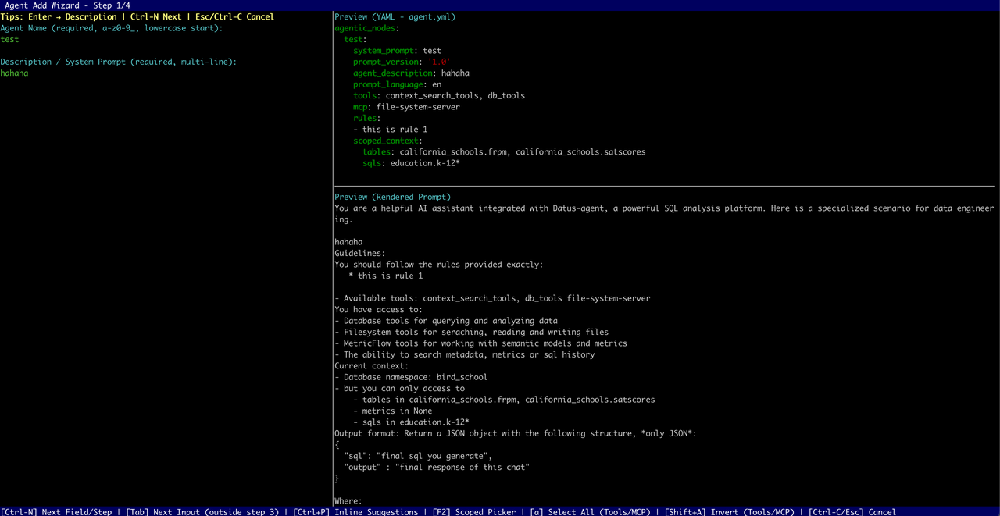

# Introduction

The `.subagent` command is a core feature provided by **Datus CLI** for managing sub‑agents. This document focuses on how to use `.subagent` to create, view, update, or delete sub‑agents, and explains its subcommands in detail. The `SubAgentBootstrapper` is a functional module within `.subagent` that builds or simulates building a **scoped knowledge base** for a specific sub‑agent. And the `.subagent` command allows full lifecycle management of sub‑agents and can trigger knowledge base construction.

---

## Command Overview

The `.subagent` command supports the following subcommands:

* **add** — Launches an interactive wizard to add a new sub‑agent.
* **list** — Lists all configured sub‑agents.
* **remove <agent_name>** — Removes a specified sub‑agent from configuration.
* **update <agent_name>** — Launches an interactive wizard to update an existing sub‑agent.
* **bootstrap <agent_name> [--components <list>] [--plan]** — Builds or simulates building a scoped knowledge base for a given sub‑agent.

If no parameters or incorrect ones are provided, the command will automatically display a help message.

> **Note:** After `add` or `update`, the system automatically builds the scoped knowledge base for the sub‑agent.

---

## Subcommand Details

### add — Create a New Sub‑Agent

Run:

```bash
.subagent add
```

This launches an interactive wizard prompting for basic information such as the sub‑agent’s **name (system_prompt)**, **description**, **tools**, **rules**, and whether it requires a scoped context. Once completed, the configuration file is saved to the project, and optionally, a corresponding prompt template file is generated.

If the creation is canceled mid‑process, a cancellation message appears, and no configuration is saved.


> 💡 **Tip:** 
> 1. In Step 2 (Native Tools Configuration), if you need to configure `context_search_tools`, please select `list_domain_layers_tree`. Failure to do so may render `search_metrics` and `search_reference_sql` inoperative.
> 2. During step three (ScopedContext configuration), you can use **Tab** for hierarchical completion but preview is unavailable. Press **F2** to preview.

---

### list — List All Sub‑Agents

Run:

```bash
.subagent list
```

The CLI displays all configured sub‑agents in a table containing:

* **Name (system_prompt)**
* **Scoped Context:** e.g., tables, metrics, SQL lists (empty if none)
* **Scoped KB Path:** shows the path to the scoped knowledge base directory ("—" if not available)
* **Tools:** list of tools used by the sub‑agent
* **MCP:** multi‑component process configuration
* **Rules:** listed in Markdown format


If no sub‑agents exist in current namespace, the CLI displays `No configured sub‑agents`.

---

### remove — Delete a Sub‑Agent

Format:

```bash
.subagent remove <agent_name>
```

Removes the configuration for the specified sub‑agent. If not found, an error message is shown. Upon successful removal, a confirmation message appears.

---

### update — Update an Existing Sub‑Agent

Format:

```bash
.subagent update <agent_name>
```



The system first checks if the target sub‑agent exists. If it does, the wizard launches with existing configuration pre‑filled. After updates are confirmed, the configuration is saved. If the changes affect the scoped context, the CLI automatically triggers `bootstrap` to rebuild the knowledge base.

---

### bootstrap — Build a Scoped Knowledge Base

This command builds or updates a sub‑agent’s scoped knowledge base (Scoped KB). It supports component selection and plan simulation.

#### Basic Usage

```bash
.subagent bootstrap <agent_name>
```

The command uses `argparse.ArgumentParser` with `prog` and `description` parameters to define program name and description. Running `.subagent bootstrap -h` displays detailed help information.

#### Parameters

* `<agent_name>` — Required. Specifies which sub‑agent to build the KB for.
* `--components <list>` — Optional. Comma‑separated list of components to build (case‑insensitive). Example:

  ```bash
  --components metadata,metrics
  ```

  If omitted, all supported components are built. Invalid components trigger an “unsupported component” message.
* `--plan` — Optional flag. Runs in **plan mode**, which calculates and displays import plans but does not write or modify files.

#### Workflow

1. **Validate and locate sub‑agent** — Parses parameters and checks if the specified sub‑agent exists.
2. **Normalize component list** — Converts to lowercase and validates against supported components (e.g., `metadata`, `metrics`, `reference_sql`). Invalid components are rejected with a supported list displayed.
3. **Execute or simulate build**

   * Without `--plan`: Executes an overwrite strategy, importing database metadata, metrics, or reference SQL, generating a new scoped KB directory, and updating the config.
   * With `--plan`: Runs simulation only, calculating the data to be imported without writing files.
4. **Display results** — Outputs a summary table (`Scoped KB Bootstrap Summary`) with columns:

   * **Component** | **Status** | **Message**
   * Status options: `SUCCESS`, `ERROR`, `SKIPPED`, `PLAN`
   * Shows scoped KB path — “Simulated scoped directory” (plan mode) or “Scoped directory” (execution mode).
5. **Show details** — For missing or invalid records, displays JSON details under `missing` and `invalid` fields.
6. **Save configuration** — On success (non‑plan mode), updates the scoped KB path in the sub‑agent’s config. Errors during save will be reported; successful saves refresh in‑memory configurations.

#### Examples

Build all components:

```bash
.subagent bootstrap my_agent
```

Simulate metadata and metrics only:

```bash
.subagent bootstrap my_agent --components metadata,metrics --plan
```

Build reference SQL only:

```bash
.subagent bootstrap my_agent --components reference_sql
```

---

## Notes

* **Name consistency:** The sub‑agent name (`system_prompt`) uniquely identifies its configuration. Ensure consistent naming for `add`, `update`, `remove`, and `bootstrap` commands.
* **Supported components:** Must be within predefined components (`metadata`, `metrics`, `reference_sql`). Check available options with `.subagent bootstrap -h`.
* **Simulation mode (`--plan`):** Used for risk evaluation; it performs no disk write. Omit this flag to perform actual construction.
* **Automatic rebuild:** Updating a sub‑agent that changes scoped context triggers an automatic rebuild to keep configurations and KBs consistent.

---

## Rebuilding Sub‑Agent Knowledge Bases in Agent

When running:

```bash
python -m datus.main bootstrap-kb
```

All sub‑agents under the current namespace with scoped context configuration will rebuild their knowledge bases. The content built depends on the `--component` parameter.
