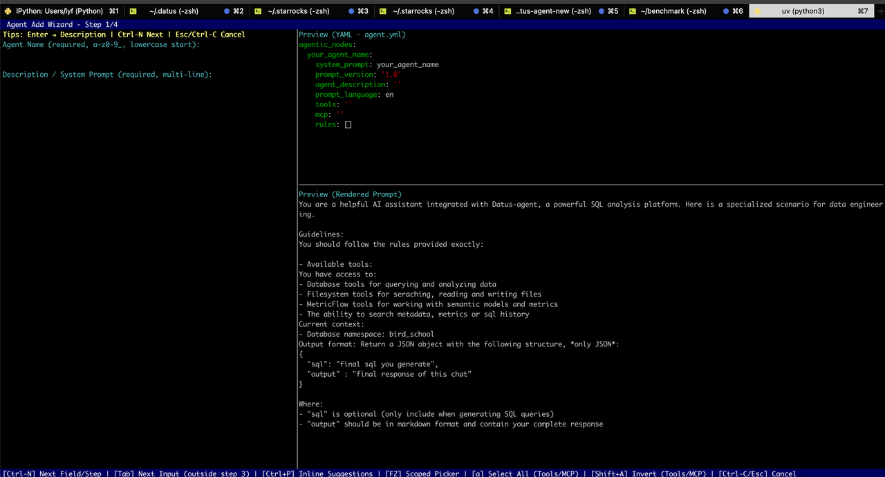
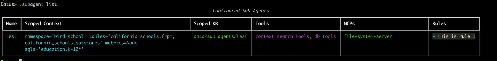
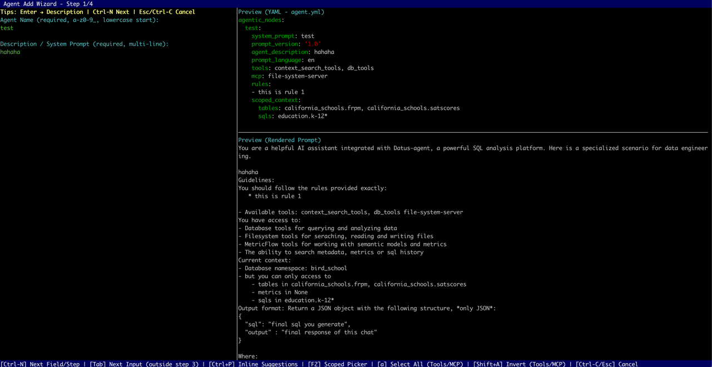

# 自定义 subagent

## 介绍

`.subagent` 命令是 **Datus CLI** 提供的核心功能，用于管理子代理。本文档重点介绍如何使用 `.subagent` 创建、查看、更新或删除子代理，并详细说明其子命令。`SubAgentBootstrapper` 是 `.subagent` 内的功能模块，用于为特定子代理构建或模拟构建 **范围化知识库**（Scoped KB）。`.subagent` 命令支持子代理的完整生命周期管理，并可触发知识库构建。

---

## 命令概览

`.subagent` 命令支持以下子命令：

* **add** — 启动交互式向导添加新的子代理。
* **list** — 列出所有已配置的子代理。
* **remove <agent_name>** — 从配置中删除指定的子代理。
* **update <agent_name>** — 启动交互式向导更新现有子代理。
* **bootstrap <agent_name> [--components <list>] [--plan]** — 为给定子代理构建或模拟构建范围化知识库。

如果未提供参数或提供了错误的参数，命令会自动显示帮助信息。

> **注意**：执行 `add` 或 `update` 后，系统会自动为子代理构建范围化知识库。

---

## 子命令详解

### add — 创建新子代理

运行：

```bash
.subagent add
```

这会启动交互式向导，提示输入基本信息，如子代理的 **名称（system_prompt）**、**描述**、**工具**、**规则**，以及是否需要范围化上下文。完成后，配置文件会保存到项目中，并可选择生成相应的提示模板文件。

如果创建过程中途取消，会显示取消消息，不会保存任何配置。


> 💡 **提示**：在第三步（ScopedContext 配置）中，可以使用 **Tab** 进行层级补全，但预览不可用。按 **F2** 可预览。

---

### list — 列出所有子代理

运行：

```bash
.subagent list
```

CLI 会以表格形式显示所有已配置的子代理，包含：

* **名称（system_prompt）**
* **范围化上下文**：例如数据表、指标、SQL 列表（如果无则显示为空）
* **范围化知识库路径**：显示范围化知识库目录的路径（如果不可用则显示 "—"）
* **工具**：子代理使用的工具列表
* **MCP**：多组件进程配置
* **规则**：以 Markdown 格式列出



如果当前命名空间中没有子代理，CLI 会显示 `No configured sub‑agents`。

---

### remove — 删除子代理

格式：

```bash
.subagent remove <agent_name>
```

删除指定子代理的配置。如果未找到，会显示错误消息。成功删除后，会显示确认消息。

---

### update — 更新现有子代理

格式：

```bash
.subagent update <agent_name>
```



系统首先检查目标子代理是否存在。如果存在，会启动向导并预填充现有配置。确认更新后，配置会被保存。如果更改影响了范围化上下文，CLI 会自动触发 `bootstrap` 重建知识库。

---

### bootstrap — 构建范围化知识库

此命令构建或更新子代理的 **范围化知识库（Scoped KB）**。它支持组件选择和计划模拟。

#### 基本用法

```bash
.subagent bootstrap <agent_name>
```

该命令使用 `argparse.ArgumentParser`，通过 `prog` 和 `description` 参数定义程序名称和描述。运行 `.subagent bootstrap -h` 会显示详细的帮助信息。

#### 参数

* `<agent_name>` — 必需。指定要为哪个子代理构建知识库。
* `--components <list>` — 可选。要构建的组件列表（逗号分隔，不区分大小写）。示例：

  ```bash
  --components metadata,metrics
  ```

  如果省略，将构建所有支持的组件。无效的组件会触发 `unsupported component` 提示。
* `--plan` — 可选标志。在**计划模式**下运行，计算并显示导入计划但不会写入或修改文件。

#### 工作流

1. **验证并定位子代理** — 解析参数并检查指定的子代理是否存在。
2. **规范化组件列表** — 转换为小写并针对支持的组件（例如 `metadata`、`metrics`、`reference_sql`）进行验证。无效的组件会被拒绝，并显示支持的列表。
3. **执行或模拟构建**

   * 不使用 `--plan`：执行覆盖策略，导入数据库元数据、指标或参考 SQL，生成新的范围化知识库目录，并更新配置。
   * 使用 `--plan`：仅运行模拟，计算要导入的数据而不写入文件。
4. **显示结果** — 输出摘要表格（`Scoped KB Bootstrap Summary`），包含列：

   * **Component** | **Status** | **Message**
   * 状态选项：`SUCCESS`、`ERROR`、`SKIPPED`、`PLAN`
   * 显示范围化知识库路径 — `Simulated scoped directory`（计划模式）或 `Scoped directory`（执行模式）。
5. **显示详情** — 对于缺失或无效的记录，在 `missing` 和 `invalid` 字段下显示 JSON 详情。
6. **保存配置** — 成功时（非计划模式），更新子代理配置中的范围化知识库路径。保存过程中的错误会被报告；成功保存会刷新内存中的配置。

#### 示例

构建所有组件：

```bash
.subagent bootstrap my_agent
```

仅模拟元数据和指标：

```bash
.subagent bootstrap my_agent --components metadata,metrics --plan
```

仅构建参考 SQL：

```bash
.subagent bootstrap my_agent --components reference_sql
```

---

## 注意事项

* **名称一致性**：子代理名称（`system_prompt`）唯一标识其配置。确保 `add`、`update`、`remove` 和 `bootstrap` 命令使用一致的命名。
* **支持的组件**：必须在预定义的组件（`metadata`、`metrics`、`reference_sql`）内。使用 `.subagent bootstrap -h` 检查可用选项。
* **模拟模式（`--plan`）**：用于风险评估；不执行磁盘写入。省略此标志以执行实际构建。
* **自动重建**：更新更改范围化上下文的子代理会自动触发重建，以保持配置和知识库的一致性。

---

## 在 Agent 中重建子代理知识库

运行：

```bash
python -m datus.main bootstrap-kb
```

当前命名空间下所有配置了范围化上下文的子代理都会重建其知识库。构建的内容取决于 `--component` 参数。

