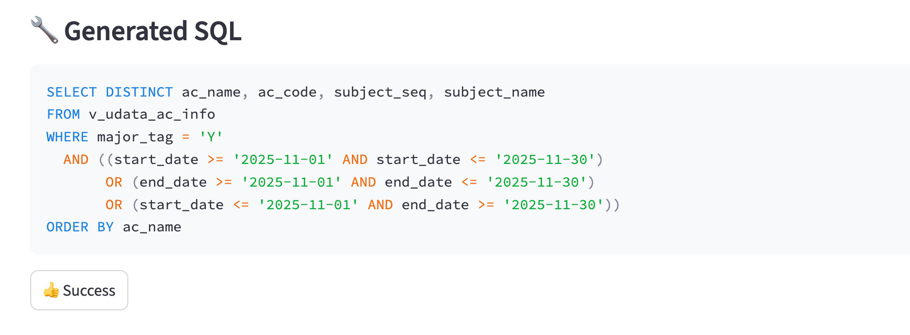
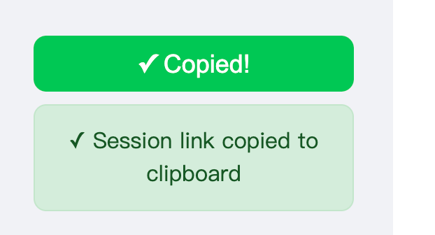

# Web Chatbot User Guide

## Overview

The Datus Web Chatbot provides a user-friendly web interface for interacting with the Datus AI assistant. Built on Streamlit, it offers an intuitive chat experience for natural language to SQL conversion without requiring command-line knowledge.

## Quick Start

### Launch the Web Interface

**With Namespace**:
```bash
datus --web --namespace <your_namespace>
```

**With Custom Configuration**:
```bash
datus --web --config path/to/agent.yml --namespace snowflake
```

**Custom Port and Host**:
```bash
datus --web --port 8080 --host 0.0.0.0
```

The web interface will automatically open in your browser at `http://localhost:8501` (or your specified port).


## Main Features

### 1. Interactive Chat Interface

**Natural Language Queries**:

Simply type your question in plain language, and the AI will generate SQL and execute it.

**Example**:

```
Show me total revenue by product category for the last month
```

The assistant will:

1. Understand your question
2. Generate the appropriate SQL query
3. Display the SQL with syntax highlighting
4. Show the AI's explanation

### 2. Subagent Support

Access specialized subagents for different tasks directly from the web interface.

**Available Subagents** (shown in expandable section):

- `gen_semantic_model`: Generate semantic models from database tables
- `gen_metrics`: Convert SQL queries to MetricFlow metrics
- `gen_sql_summary`: Analyze and classify SQL queries

**How to Use**:

1. Click "🔧 Access Specialized Subagents" on the main page
2. Select the subagent you need
3. Click "🚀 Use [subagent_name]"
4. Chat with the specialized assistant

**Direct URL Access**:

You can bookmark subagent URLs for quick access:

```
http://localhost:8501/?subagent=gen_metrics
http://localhost:8501/?subagent=gen_semantic_model
```

### 3. Session Management

**View Session History**:

The sidebar shows your recent chat sessions with:

- Session ID (shortened)
- Creation time
- Message count
- Latest user message preview

**Load Previous Sessions**:

1. Find the session in the sidebar
2. Click "🔗 Load Session"
3. View the conversation in read-only mode

**Session Sharing**:

Each session has a unique URL that can be shared:

```
http://localhost:8501?session=abc123def456...
```

### 4. Success Story Tracking

**Mark Successful Queries**:

When the AI generates a SQL query that works well:

1. Review the generated SQL
2. Click the "👍 Success" button
3. The query is saved to `~/.datus/benchmark/[subagent]/success_story.csv`



**CSV Format**:

```csv
session_link,session_id,subagent_name,user_message,sql,timestamp
http://localhost:8501?session=...,abc123...,chatbot,"Show revenue by category",SELECT ...,2025-01-15 10:30:00
```

This helps track effective queries for benchmarking and improvement.

### 5. Report Issues

**Share Problems Easily**:

1. Click "🐛 Report Issue" in the sidebar
2. Session link is automatically copied to clipboard
3. Paste the link when reporting issues to developers

The session link includes full conversation context, making debugging easier.

{ width="50%" }

## Summary

The Datus Web Chatbot provides:

- **User-Friendly Interface**: No command-line knowledge needed
- **Subagent Access**: Specialized assistants for different tasks
- **Session Management**: Save, load, and share conversations
- **Success Tracking**: Mark and collect effective queries
- **Easy Sharing**: One-click session link copying
- **Visual Execution**: See step-by-step query generation
- **Multi-Namespace Support**: Switch between databases easily
