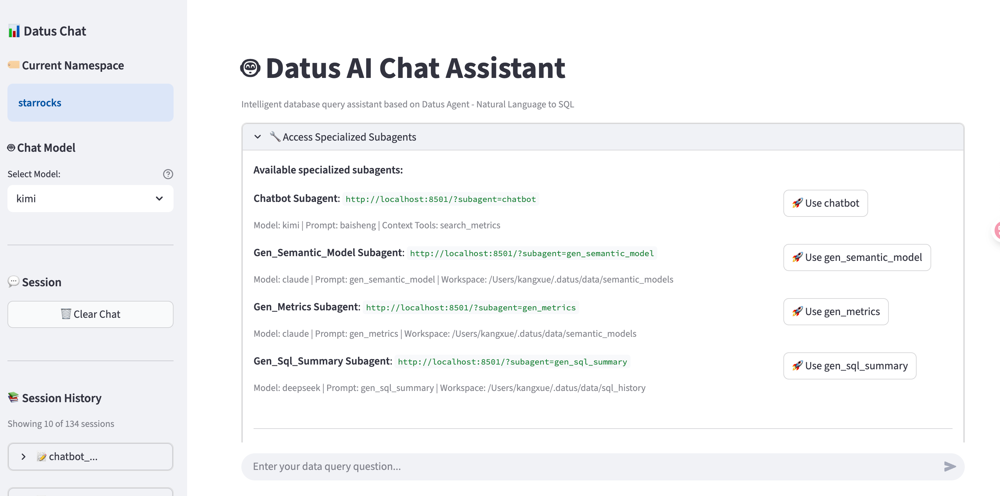

# Web chatbot 用户指南

## 概览

Datus Web chatbot 提供一个易用的网页界面，用于与 Datus AI 助手交互。它基于 Streamlit 构建，面向自然语言转 SQL 的场景，用户无需掌握命令行即可完成对话式分析。

## 快速开始

### 启动网页界面

**指定命名空间**：
```bash
datus --web --namespace <your_namespace>
```

**使用自定义配置**：
```bash
datus --web --config path/to/agent.yml --namespace snowflake
```

**自定义端口与主机**：
```bash
datus --web --port 8080 --host 0.0.0.0
```

浏览器将自动打开 `http://localhost:8501`（或你指定的端口）。



## 核心功能

### 1. 交互式对话界面

**自然语言提问**：

直接输入问题，AI 会生成并执行 SQL。

**示例**：
```
Show me total revenue by product category for the last month
```

助手将会：

1. 理解你的问题
2. 生成相应的 SQL 查询
3. 以语法高亮的形式展示 SQL
4. 给出 AI 的解释说明

### 2. Subagent 支持

在网页界面中直接访问面向不同任务的专用 subagent。

**可用 subagent**（在可展开区域中展示）：

- `gen_semantic_model`：从数据库表生成语义模型
- `gen_metrics`：将 SQL 查询转换为 MetricFlow 指标
- `gen_sql_summary`：分析与分类 SQL 查询

**使用方式**：

1. 在主页点击 "🔧 Access Specialized Subagents"
2. 选择需要的 subagent
3. 点击 "🚀 Use [subagent_name]"
4. 与专用助手对话

**直达 URL**：

你可以收藏 subagent 的 URL 便于快速访问：

```
http://localhost:8501/?subagent=gen_metrics
http://localhost:8501/?subagent=gen_semantic_model
```

### 3. 会话管理

**查看会话历史**：

侧边栏显示最近的会话信息，包括：

- 会话 ID（截断显示）
- 创建时间
- 消息数量
- 最新用户消息预览

**加载历史会话**：

1. 在侧边栏找到目标会话
2. 点击 "🔗 Load Session"
3. 以只读方式查看会话内容

**会话分享**：

每个会话都有唯一可分享的链接：

```
http://localhost:8501?session=abc123def456...
```

### 4. 成功案例归档（Success Story）

**标记有效查询**：

当 AI 生成的 SQL 工作良好时：

1. 先审阅生成的 SQL
2. 点击 "👍 Success" 按钮
3. 查询会保存到 `~/.datus/benchmark/[subagent]/success_story.csv`


**CSV 格式**：

```csv
session_link,session_id,subagent_name,user_message,sql,timestamp
http://localhost:8501?session=...,abc123...,chatbot,"Show revenue by category",SELECT ...,2025-01-15 10:30:00
```

这有助于沉淀有效查询用于基准评测与持续改进。

### 5. 问题反馈（Report Issues）

**便捷分享问题**：

1. 在侧边栏点击 "🐛 Report Issue"
2. 系统会自动将会话链接复制到剪贴板
3. 将链接粘贴给开发者即可定位问题

会话链接包含完整的对话上下文，便于排查与复现。

{ width="50%" }

## 总结

Datus Web chatbot 提供：

- **易用的界面**：无需命令行知识
- **Subagent 直达**：按任务启用专用助手
- **会话管理**：保存、加载与分享对话
- **成功归档**：标记并收集有效查询
- **一键分享**：复制会话链接
- **可视化执行**：逐步展示 SQL 生成过程
- **多命名空间支持**：便捷切换数据库
